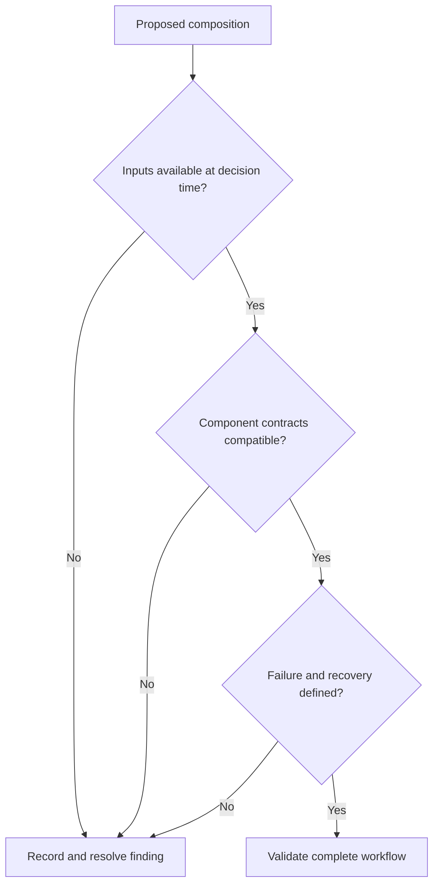
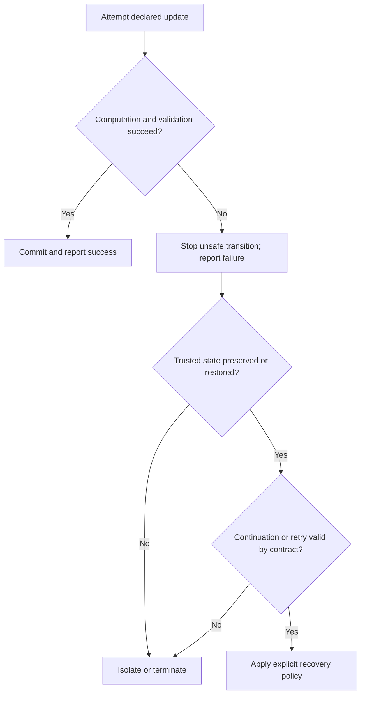
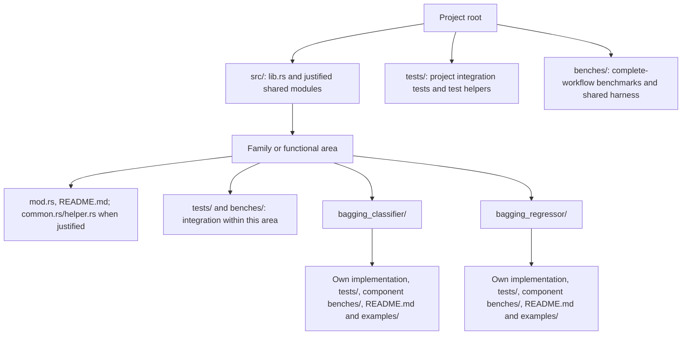
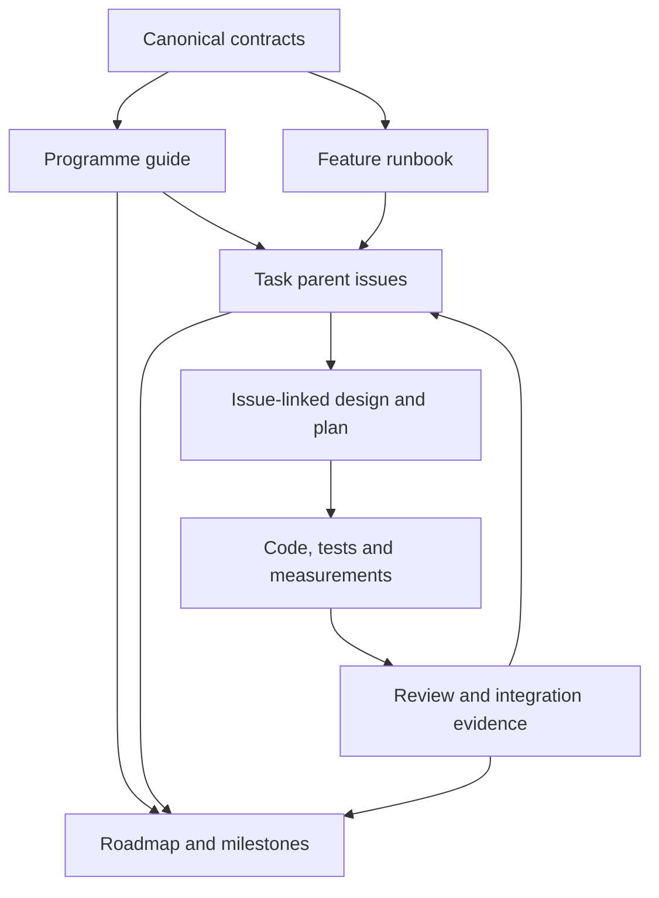
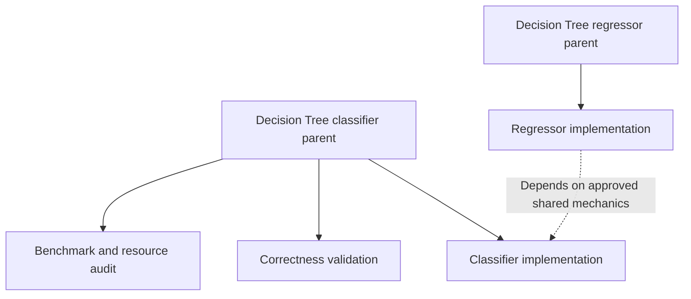

# Seqvex streaming ML design - discussion draft

> **Status:** DRAFT v4 - for Maintainer review; not an implementation authorization.
> **Date:** 2026-10-06, Asia/Singapore (revision; source checkpoint unchanged).
> **Proposed repository destination:** `docs/STREAMING_ML_DESIGN.md`.
> **Audience:** Seqvex users, researchers, Maintainer, Architect, Planner, Coder and independent reviewers.
> **Repository checkpoint:** `rust-development` at `61bca3156997b90671599fbeb48121c8284be899`, verified from the remote branch during drafting.
> **Purpose:** Establish a usable ML programme and its shared contracts before detailed algorithm designs, implementation plans and a final roadmap.
> **Authority:** This draft records agreed discussion direction and proposals. It does not override the canonical development contract, close issues, declare production readiness, or modify existing APIs.

## Publication boundary

Public repository documents, code comments and issue records should contain project requirements, contracts, decisions and relevant evidence. Do not include personal filesystem paths, account identities, access privileges, connection or session settings, private authorization discussions, or assistant/plugin/tool branding unless explicitly requested for publication. Describe responsibilities using project roles and distinguish reported evidence from independently verified evidence without identifying private tooling.

## 1. User objective and document boundaries

Seqvex is an open-source Rust ML library whose primary intended beneficiaries are the Maintainer and a small quantitative research/trading team. Users need complete, understandable learning and deployment workflows for selected common algorithms, with streaming first and bounded micro-batching as the additional public execution mode.

The programme prioritizes mathematical correctness, causal use of sequential/non-IID data, deliberate failure handling and idiomatic Rust. Software, workflow and Rust optimizations precede hardware specialization for each selected delivery. Hardware optimization remains an intended programme direction, with concrete entry criteria and separate designs.

This document is the general guide. It contains the programme's shared contracts, teaching explanations, decision rules, proposed catalogue, review checklist and roadmap outline. Detailed mathematics and implementation sequencing belong in issue-linked algorithm records. Do not create a separate document for every checklist entry or ordinary decision.

General ingestion, exchange connectivity, databases, generic ETL and trading/business logic remain outside Seqvex. ML-specific transformation, training, evaluation, persistence of ML state and execution coordination fall within its computational responsibility. Any event collector described here is a narrow ML execution adapter, not a general ingestion platform.

### Reading labels

- **CURRENT:** directly inspected repository behavior or document content; the supporting boundary is stated.
- **AGREED DIRECTION:** accepted in this design discussion, but not necessarily implemented or incorporated into canonical documents.
- **PROPOSAL:** a draft choice requiring review before it becomes an implementation contract.
- **CANDIDATE:** a possible algorithm, technique or extension, with no delivery commitment.
- **DEFERRED:** intentionally outside the present implementation decision.
- **OPEN DECISION:** must be resolved before affected implementation proceeds.

Use the repository's established evidence vocabulary in formal reviews: FACT, MEASURED EVIDENCE, INFERENCE, ASSUMPTION, PROVISIONAL DECISION, ARCHITECTURAL DECISION and OPEN QUESTION. A draft recommendation is not measured evidence.

## 2. Relationship to existing governance

Read the actual source, tests and affected documentation before an algorithm design. Relevant authorities are:

| Document | Role in this programme |
|---|---|
| [Development contract](https://github.com/Skybrique/seqvex/blob/61bca3156997b90671599fbeb48121c8284be899/docs/DEVELOPMENT.md) | Engineering gates, architecture review, scope, conflict handling and evidence |
| [Feature runbook](https://github.com/Skybrique/seqvex/blob/61bca3156997b90671599fbeb48121c8284be899/FEATURE_DEVELOPMENT.md) | Issue decomposition, roles, lifecycle, validation matrix and templates |
| [Architecture](https://github.com/Skybrique/seqvex/blob/61bca3156997b90671599fbeb48121c8284be899/ARCHITECTURE.md) | Ownership, execution/placement separation and deferred architecture |
| [Failure and recovery](https://github.com/Skybrique/seqvex/blob/61bca3156997b90671599fbeb48121c8284be899/docs/FAILURE_AND_RECOVERY.md) | State integrity, explicit failure and recovery principles |
| [Execution README](https://github.com/Skybrique/seqvex/blob/61bca3156997b90671599fbeb48121c8284be899/src/execution/README.md) | Existing execution behavior and ownership |
| [Vertical-slice evidence](https://github.com/Skybrique/seqvex/blob/61bca3156997b90671599fbeb48121c8284be899/docs/ML_VERTICAL_SLICES.md) | Existing algorithm scope and retained measurements |
| [Correctness audit](https://github.com/Skybrique/seqvex/blob/61bca3156997b90671599fbeb48121c8284be899/docs/ALGORITHM_CORRECTNESS_AUDIT.md) | Audit findings and its specific revision of record |
| [Current roadmap](https://github.com/Skybrique/seqvex/blob/61bca3156997b90671599fbeb48121c8284be899/docs/ROADMAP.md) | Historical/current phase record to reconcile after design approval |

CURRENT: the development contract already establishes CRITICAL ARCHITECTURE REVIEW (section 3), testing (section 17), performance engineering (section 19), hardware flexibility (section 20), a Common Audit Core (section 33.2) and an optimization gate (section 33.3). The runbook supplies five review dimensions (section 15), a validation matrix (section 16) and parent/child/PR templates (section 18).

**Critical-document change protocol:** this discussion authorizes revisions to this draft and a proposed correctness guide. It does not authorize editing ARCHITECTURE.md, docs/DEVELOPMENT.md, FEATURE_DEVELOPMENT.md, or other standing principles. Before proposing a critical-document amendment, notify the Maintainer of the exact passage, the mismatch, the rationale, the proposed change and affected contracts. Obtain explicit authorization for the amendment; draft approval alone does not authorize it. No critical repository document was edited for v2.

[Randomness and parameter initialization](https://github.com/Skybrique/seqvex/blob/61bca3156997b90671599fbeb48121c8284be899/docs/RANDOMNESS.md) is also authoritative within its declared scope. It is not a general sampling service.

The companion [CORRECTNESS.md](CORRECTNESS.md) is a proposed standing guide for correctness evidence. Its intended repository location is docs/CORRECTNESS.md. It differs from the existing ALGORITHM_CORRECTNESS_AUDIT.md, which records an audit of specific revisions. Adopting the guide does not reopen accepted issues or alter historical audit conclusions.

Section 16 consolidates an optimization-option checklist around these existing rules. It proposes neither a generic audit runtime nor automatic permission to redesign code.

### Known direction difference requiring explicit reconciliation

AGREED DIRECTION: two public delivery modes, streaming and bounded micro-batching; one-observation execution is the streaming primitive.

CURRENT: the canonical development contract, architecture and execution README also describe larger-batch execution as a secondary capability. Incorporating the narrower direction requires an explicit documentation/architecture decision. This draft does not silently remove existing ordered-fold helpers or forbid large historical training datasets.

Batch-fit is a learning method; it is not automatically a third public delivery mode. The detailed learner design must define retained data, repeated passes and replay requirements honestly.

## 3. Decision preference

AGREED DIRECTION: among sensible, feasible options, prefer those that improve resource efficiency, useful results, numerical/statistical accuracy and correctness while keeping reversal cost low.

Apply this preference in the following order:

1. Reject options that violate the approved mathematical, causal, failure or deployment contract.
2. Compare useful results and learning/inference quality under the intended workload.
3. Compare latency, throughput, memory, allocation, energy where measurable, and development/maintenance cost.
4. Compare reversibility: public API exposure, persisted formats, ownership, dependencies, migration and downstream coupling.
5. Prefer the smallest supported mechanism with favorable evidence. Do not invent an aggregate score to conceal trade-offs.

Correctness is a constraint. Predictive quality is measured under an appropriate temporal protocol. Numerical accuracy and bitwise reproducibility are distinct requirements and may need separate decisions.

### Decision record used inside an owning design or issue

| Field | Required content |
|---|---|
| Objective | User problem, algorithm requirement or measured bottleneck |
| Feasible alternatives | Small set of concrete choices |
| Correctness constraints | Mathematics, sequence, numerical envelope and failure |
| Expected benefit | Labeled assumption until measured |
| Evidence | Tests, oracle, workload and benchmark provenance |
| Resource implications | Time, memory, transfers, synchronization, build and maintenance |
| Reversal cost | What would change later, who consumes it, and migration implications |
| Choice and revisit trigger | Why selected; what evidence would reopen it |

Low reversal cost is reasoned from concrete boundaries, not guaranteed by a label.

## 4. Complete workflow and production readiness

AGREED DIRECTION: complete a selected algorithm/task end to end, review its local architecture, then advance through the selected family catalogue. A family milestone covers an agreed finite catalogue, not every algorithm in that family.

The smallest complete implementation includes the necessary components for its declared production workflow. It handles common edge cases and explicit unsupported cases. It has no known unresolved blocking findings within its reviewed operating envelope; this is not a guarantee that undiscovered defects cannot exist.

Each delivery must establish:

- Mathematical specification, supported task and numerical envelope.
- Prediction outputs, including probabilities or scores when intrinsic to the selected task.
- Its declared training/learning method, objective and stopping behavior.
- Initialization, reset, continuation and independent execution semantics.
- Streaming and bounded micro-batch contracts where supported.
- Required preprocessing, evaluation and learned-parameter export/import.
- Checkpoint/restart requirements where the deployment cannot otherwise meet its recovery objective.
- Independent correctness evidence and appropriate dependent-data evaluation.
- Failure, capacity and resource behavior.
- Measured performance baseline and reference/optimized distinction.
- Teaching README, rustdoc and practical examples.
- Independent review, required checks and separately authorized integration.

No blanket requirement makes every algorithm learn online. No existing inference-only issue is retroactively enlarged into a training delivery.

## 5. Proposed algorithm catalogue and task ownership

Classifier and regressor deliveries have separate parent objectives where the tasks have independently meaningful acceptance. Shared implementation does not confer shared completion. A model family does not need artificial classifier/regressor counterparts.

This is a proposed programme catalogue, not a queue of authorized implementation issues.

| Family or responsibility | Algorithm/method | Task deliveries | Discussion status |
|---|---|---:|---|
| Linear models | Ordinary least-squares | Regression: 1 | AGREED DIRECTION |
| Linear models | Ridge, L2-regularized least-squares | Regression: 1 | AGREED DIRECTION |
| Linear models | Lasso, L1-regularized least-squares | Regression: 1 | AGREED DIRECTION |
| Linear models | Logistic model with selected L1/L2 support | Classification: 1 | AGREED DIRECTION; binary/multiclass scope needs design |
| Linear sequential estimation | RLS | Regression/estimation: 1 | AGREED DIRECTION; existing production gates preserved |
| Trees | Decision Tree | Classification and regression: 2 | PROPOSAL for full training workflows beyond current inference |
| Trees | Hoeffding Tree | Classification and regression: 2 | AGREED DIRECTION; exact variants need analysis |
| Ensembles | Bagging with Decision Tree members | Classification and regression: 2 | PROPOSAL retained for task-specific design |
| Ensembles | Random Forest | Classification and regression: 2 | PROPOSAL; strong relevance to stated tree use |
| Ensembles | Gradient-boosted Trees | Classification and regression: 2 | PROPOSAL; exact boosting method/loss scope needs selection |
| Neighbors | KNN | Classification and regression: 2 | PROPOSAL; bounded reference-set lifecycle needs design |
| Recurrent models | GRU with task-specific prediction head | Classification and regression: 2 | PROPOSAL for complete trainable predictors |
| Clustering | K-means | Clustering: 1 | PROPOSAL; streaming variant versus replayed Lloyd fitting unresolved |

If accepted unchanged, this table describes 13 named methods and 20 task deliveries. The numbers are planning aids, not acceptance or milestones already approved. Classification variants are not automatically separate parents for every binary/multiclass option; split only when objectives and acceptance warrant it.

Additional candidates: Elastic Net, adaptive Hoeffding variants, online bagging, LSTM, Extra Trees and other team-driven methods. Adaptive Hoeffding analysis belongs in the Hoeffding selection decision because distribution shift matters to the intended workload. It is not silently included in standard Hoeffding mathematics.

Transformers and RL remain later scope because they require additional training, representation and interaction contracts. This is a sequencing decision; a necessary component of an accepted algorithm cannot be postponed under this rule.

"Online" describes learning lifecycle, not a required mathematical family directory. The existing RLS file location need not change merely to adopt this vocabulary.

### Linear analysis requirements

Declare loss normalization, intercept treatment, penalties, feature scaling, sample weighting, solver, convergence/status, numerical conditioning and tolerances. L1-regularized logistic classification is not Lasso regression renamed as classification. RLS forgetting and excitation/conditioning boundaries remain explicit.

### Tree and ensemble analysis requirements

Specify split objectives, sufficient statistics/observers, thresholds, ties, leaf outputs, class mapping, growth limits, retained training data and required sampling. An inference tree supplied by a caller is not a completed tree trainer.

Specify member ownership, seeds, resampling, aggregation, learning coordination, failure and persistence. Conventional bootstrap bagging and online Poisson-multiplicity bagging are distinct learning methods. Random Forest feature sampling remains explicit; gradient boosting has its own sequential training contract.

OPEN DECISION: ensemble data sampling, feature sampling and Poisson multiplicities require a scoped randomness/ownership design before implementation. The existing RANDOMNESS.md facility generates parameter values only and explicitly excludes sampling, resampling and ordering. Do not assume it can be reused or expanded without the required architecture decision. Define deterministic logical member identities, generator advancement, checkpoint/retry behavior and temporal constraints in the owning design.

A standard Hoeffding tree is incremental; drift adaptation and guarantees under dependent observations must be analyzed separately. No claim of universal non-IID suitability follows from its name.

## 6. Learning lifecycles and plug-and-play usage

AGREED DIRECTION: support three learning lifecycles independently of execution mode.

| Lifecycle | User-visible behavior | Typical use |
|---|---|---|
| Frozen inference | Parameters stay fixed until explicit replacement | Deploy a reviewed model |
| Incremental/adaptive learning | Explicit learning events update the declared learned state | RLS, Hoeffding, selected incremental learners |
| Periodic retraining | Train a candidate from a declared data window; evaluate; publish a new version | Conventional trees, ensembles and fitted linear models |

High data volume does not itself determine retraining frequency. Label availability, drift, quality, resource cost and deployment risk determine the policy.

Plug-and-play means sensible defaults, compatible components and understandable operations. Prediction does not secretly retrain. Publication of parameters and preprocessing changes is visible.

**Example:** minute-by-minute predictions with a next-day target cannot learn from those targets at prediction time. When labels mature, a declared learning/retraining workflow consumes them.

### Ownership domains

1. Model parameters and the preprocessing snapshot needed to interpret inputs.
2. Per-sequence inference/estimation state.
3. Trainer/optimizer state and any retained history.
4. Temporary execution-owned workspace.
5. Published model/checkpoint metadata and format.

PROPOSAL: train candidates separately from a live frozen inference snapshot where that deployment lifecycle is selected. Define publication boundaries and version association. Recurrent hidden-state continuation across a parameter replacement is an explicit algorithm/deployment decision, not an automatic operation.

Incremental learning deployments also need an explicit concurrency and publication contract; immutable snapshots are not a claim that every learner already supports cheap snapshots.

## 7. Composability without a universal framework

AGREED DIRECTION: users can combine necessary preprocessing, algorithms, evaluation and persistence through clear contracts.

| Boundary | Contract |
|---|---|
| Input/output | Shape, target type, feature schema, class mapping and numerical requirements |
| Learning | Frozen, incremental/adaptive or periodic fit behavior |
| State | Learned parameters, sequence state, trainer history and temporary workspace |
| Ordering | Transform, predict, evaluate and learn sequence |
| Failure | Committed progress, preserved state, safe retry and next permitted action |
| Persistence | Components restored together, compatibility/version rules |

**Example:** causal feature construction plus scaling plus Ridge can be compared with the same compatible workflow using Lasso. Learned scaling and coefficients form a consistent deployment version.

Updating a scaler under unchanged coefficients changes the model's input coordinates. An online-transformer/learner design must resolve this interaction. Delayed-label workflows preserve the original prediction and enough event/feature/version context to evaluate and learn correctly later.

### Composition readiness workflow



PROPOSAL: use a small typed composition mechanism derived from selected workflows. Inspect current code and the concrete planned consumers before introducing traits. No universal pipeline graph, tensor type or learning trait is mandated here.

Design classifier/regressor pairs jointly to identify incompatible requirements. Implement complete deliveries separately. Share internal components when their responsibilities are established; expose a reusable public interface only where user composition requires it. This is advance contract analysis, not mandatory speculative refactoring.

## 8. Sequential/non-IID correctness and causal evaluation

Non-IID is not one capability flag. Distinguish mathematical temporal dependence, serial correlation, distribution shift, learning lifecycle and evaluation methodology.

Every algorithm/workflow design declares:

- Event order and the source of that order.
- Feature availability and label maturity.
- Training, validation and evaluation boundaries.
- Preprocessing fit/update timing.
- Reset, independent sequence and group boundaries.
- Sampling/shuffling purpose and statistical assumptions.
- Retained information and long-run growth.
- Tested dependent-data regimes, limitations and quality measures.

No implicit shuffle across recurrent transitions, sequential update histories or temporal evaluation boundaries is allowed. Sampling inside an available historical training window may be valid for a declared algorithm, but does not establish independent observations or justify random-fold evaluation.

Where label intervals overlap, analyze purging/embargo or an equivalent appropriate temporal protocol. Do not apply a technique mechanically without defining the leakage mechanism it prevents.

**Example:** fitting a transformer on the full dataset before a chronological split leaks later information. Fitting it on the eligible training subset and applying that frozen representation to later evaluation respects that boundary.

Temporal correctness tests should deliberately introduce future feature/label availability, overlapping horizons, resets, repeated observations, out-of-order inputs and shifted regimes. Predictive evaluation is separate from mathematical oracle testing.

## 9. Streaming and bounded micro-batching

One observation is the declared semantic input unit. It might be a feature vector built from a causal window, not one raw market event.

A micro-batch is a bounded group containing actual size B up to a declared B_max. It does not turn B examples into one observation.

PROPOSAL for initial incremental learning: transport grouping preserves the same update sequence as individual execution, including schedules, counters, random draws and committed-prefix failure behavior.

**Example:** a call containing A, B and C applies A to the current parameters, then B to the result of A, then C to the result of B. Averaging three gradients computed at the original parameters and updating once is a different learning policy.

For conventional fitting, historical replay through bounded input groups can still require retained data and multiple passes. Declare that requirement. For GRU, distinguish transport B, sequence boundaries, differentiation horizon H and parameter-update interval.

### Technical contract required per algorithm

- Borrowed/owned input and output representation.
- Bounds, empty-group behavior and preflight validation.
- Update order and permitted independent computation.
- Required workspace and capacity behavior.
- Failure index, committed progress and recoverable state.
- Allocation, memory footprint and partial final groups.
- Equivalence expectation: bitwise, declared tolerance, or explicitly different learning policy.
- Retry, cancellation and continuation semantics.

PROPOSAL: algorithms initially accept caller-supplied bounded groups. They do not silently collect events or wait for a queue to fill.

If a collection adapter is selected, specify count/time/manual/end-of-stream flushing, queue capacity, backpressure, grouping by sequence, shutdown and timeout semantics. A waiting threshold is not a hard completion-latency guarantee. No hidden scheduler or Auto policy is implied.

## 10. Failure, recovery and declared assumptions

This is mission-critical design. Use [FAILURE_AND_RECOVERY.md](https://github.com/Skybrique/seqvex/blob/61bca3156997b90671599fbeb48121c8284be899/docs/FAILURE_AND_RECOVERY.md) as the reference; report contradictions immediately before affected work proceeds.

The existing document establishes state integrity and explicit recovery, but deliberately defers exact mechanisms. The detailed algorithm design must resolve applicable choices rather than present them as already implemented.

### Required failure analysis

| Question | Required answer |
|---|---|
| What can fail? | Input, numeric, invariant, resource, runtime/device, persistence and publication cases |
| What is one commit? | Transition, learner update, ensemble update or another declared unit |
| What state is protected? | Parameters, recurrent/estimation state, optimizer, preprocessing, counters and RNG where relevant |
| What is visible? | Error category, affected operation, progress and permitted next actions |
| Is retry safe? | Event identity/replay semantics and duplicate-update prevention |
| Can execution continue? | Algorithm-specific impact of skipped/late/missing observations |
| What survives termination? | Durable checkpoint/version and replay source, when required |
| What is the cost? | Memory, copying, latency, synchronization and storage |
| What is unsupported? | Explicit termination/isolation/operator boundaries |

PROPOSAL: one incremental ensemble observation commits coherently across affected members. If a member fails, successful members must not remain silently advanced. Select staging, rollback information or another mechanism after analyzing cost; whole-ensemble copying is not mandated.

Scratch may change during provisional work, but must be safely reusable or reinitialized. Declared failure state includes relevant RNG and optimizer progress. A retry that changes draws or doubles member updates is not equivalent replay.

For a bounded group, successful prior observations may remain committed under the accepted prefix contract. That does not authorize partial commit inside a single observation's declared update unit.



Preserved state does not automatically justify skipping an event. A sequence gap may require stop/replay. Library errors use explicit results for expected failures; panic is not the routine input-validation mechanism.

No library guarantees survival of process termination, hardware loss or ordinary unrecoverable allocation failure. Declare supported recovery and deployment supervision boundaries. Checkpoint formats, frequency and replay requirements must be resolved for deployments that depend on them.

### Assumption register

Each analysis records the assumption, rationale, failure if false, detection method, owner and evidence/revisit trigger. Examples include input ordering responsibility, available labels, bounded shapes, class universe, memory capacity, persisted-data availability and host/device trust.

On contradiction, record repository fact, proposed design, impact and recommended escalation. Stop the affected workstream until resolved; unrelated approved work may continue.

## 11. Fearless concurrency, streams and scheduling

AGREED DIRECTION: use Rust's fearless concurrency through ownership, borrowing and suitable Send/Sync bounds. This applies to thread-based parallelism as well as asynchronous programs.

| Concept | Actual meaning | What it does not promise |
|---|---|---|
| Send | A value can be safely transferred to another thread | Parallel execution, ordering or zero overhead |
| Sync | Shared references to the type can be safely sent between threads; T is Sync when &T is Send | A lock, a blocking operation, or a synchronous execution mode |
| async/await | Futures can suspend and resume; useful for overlapping waiting when the runtime/operations support it | Automatic CPU parallelism or protection against blocking code |
| Rayon | CPU task parallelism with work stealing | Zero scheduling cost, preserved arbitrary event order or an I/O runtime |
| Lock-free structure | System-wide progress under its stated algorithm/conditions | Wait-free per-caller progress, no contention or guaranteed low latency |

Send and Sync are marker traits, not runtime synchronization operations. A Mutex may block because of its locking operation; the Sync trait itself does not block. An async task that executes blocking I/O or lengthy CPU work without yielding can occupy its executor thread. The selected runtime may run futures on one or several threads.

Fearless concurrency reduces data-race risk through Rust's type and ownership rules. It does not prove mathematical ordering, deadlock freedom, deterministic reductions, retry correctness or correct deployment versioning. Avoid unsafe Send/Sync implementations merely to satisfy a parallel API.

| Work | Concurrency opportunity and constraint |
|---|---|
| Independent frozen-model streams | Separate sequence state/workspace; immutable compatible parameters |
| Dependent updates in one sequence | Preserve order and exclusive update ownership |
| Independent ensemble-member computation | Parallel candidates; coordinated commit and declared aggregation |
| Training candidates/experiments | Independent learners and bounded CPU/memory budgets |
| Shared adaptive learner across streams | Define global learning order/publication; thread safety alone is insufficient |
| Input handoff | Bounded channel/queue with ordering, full-capacity and shutdown contracts |

**Example:** two GRU streams can use different execution-owned state/workspace concurrently. Each stream still applies its own observations in recurrence order. Their parameters may be shared only under the approved immutable/publication contract.

CANDIDATE: Rayon work stealing for sufficiently large independent compute tasks. Compare stable stream assignment for locality and predictability with dynamic scheduling. Do not schedule dependent transitions as unrelated jobs. Parallel inference, training and micro-batch dispatch are separate contracts, not automatic consequences of using par_iter.

Use stable seed assignment from logical member/task identity where determinism is promised, subject to the scoped randomness decision in Section 5. Define aggregation order and failure commit behavior. Avoid uncontrolled nested pools and CPU oversubscription. Async coordination and Rayon computation may coexist if a concrete workflow needs both; runtime ownership, cancellation and bounded handoff require design.

CANDIDATE: established bounded queues, channels and lock-free structures where communication requires them. Prefer less shared mutation before sophisticated synchronization. Never silently drop work on a full queue.

Concurrency support in a first algorithm design need not require a scheduler implementation. Protect compatible ownership boundaries now; adopt scheduling machinery through measured, separately reviewed scope.

## 12. Idiomatic Rust, bounded memory and allocation

AGREED DIRECTION: prefer clear safe Rust, slices, suitable iterators/loops, concrete ownership and only justified abstraction. Preallocation is compatible with idiomatic Rust.

Declare initialization, steady-state compute, adaptation/growth, output storage and recovery separately.

PROPOSAL: within a declared capacity envelope, selected steady-state kernels perform no heap allocation or reallocation. Verify the actual region; do not imply zero setup memory or a universal zero-allocation framework.

Specify model/trainer/state/workspace memory across simultaneous streams. Check growth and capacity arithmetic. Avoid avoidable clones and materialized intermediate collections. Prepared buffers may need initialization/warm-up; capacity reservation alone does not initialize usable elements.

Growing Hoeffding trees require memory/node limits or a defined growth policy. A growth event can allocate outside a measured kernel; its cost and failure remain part of the complete update workflow. Reaching a limit must produce an explicit result/status according to the declared learning policy.

DEFERRED CANDIDATE: mimalloc/jemalloc deployment experiments. Their choice should remain in a consuming application and outside public model types. The current counting allocator wraps System; instrumentation does not make alternatives infeasible. Maintaining allocator-neutral APIs keeps anticipated architectural reversal cost low. Platform and harness integration still need validation.

Host allocator selection does not solve device allocation, placement or transfer.

## 13. Numerical accuracy, SIMD, layout and cache

### Numerical semantics and the SIMD update

AGREED DIRECTION: SIMD remains an intended optimization option. Begin with compiler optimization of idiomatic code; introduce explicit SIMD only for a measured bottleneck and an approved numerical/safety contract.

SIMD applies an operation to multiple lanes. Many elementwise operations can preserve each lane's arithmetic semantics. A reduction, such as a dot product, can instead change how additions are grouped. Floating-point addition is not associative.

**Illustrative f32 example:** with a = 1e20, b = -1e20 and c = 3, rounding each intermediate to f32 gives (a + b) + c = 3, whereas a + (b + c) = 0. This explains a numerical issue; it is not a new repository measurement.

Fused multiply-add rounds once rather than rounding a multiply and addition separately. It can improve accuracy while changing bit patterns. Bitwise agreement and numerical accuracy are different requirements.

"Do not relax floating-point semantics merely to obtain SIMD" means: do not silently permit reassociation, different exceptional-value behavior, changed precision, approximated functions or a new FMA/reduction policy solely for a speed result. Propose any changed policy with independent accuracy evidence, supported tolerances, sequence/threshold tests and approval. SIMD itself does not require all these changes.

For GRU, possible lanes include independent output units at a time step or independent compatible streams. Consecutive time steps of one recurrence are dependent. Training has additional gradient/reduction dependencies. The vectorization direction must be derived from the mathematics.

### AoS, SoA and mixed representations

| Layout | Description | Potential benefit and cost |
|---|---|---|
| AoS | Array of records, with fields of one record together | Convenient record-local access; one-field access across records can have larger strides |
| SoA | Separate arrays for fields | Often contiguous access across many values of one field; accessing all fields of one record can be less local |
| AoSoA | Blocks of records represented as arrays of fields | A deliberate hybrid for blocked vector/cache access; block choice and packing costs require evidence |
| Contiguous matrix | Rows/columns according to a specified stride | Already suitable for many vector kernels without a record-to-SoA transformation |

AoS and SoA can coexist in one system and even participate in a mixed blocked representation. SIMD does not require an exclusively SoA project. Gather/scatter, compiler transformations and contiguous matrix access may support vectorization under other layouts, with workload-dependent costs.

Do not expose one CPU layout as a permanent universal public or persisted representation. Backend-local packed forms may be prepared explicitly where justified. Include conversion, copies, retained duplicate storage and publication/recovery implications in complete-operation measurements.

### SIMD feasibility questions

1. Are operations independent in the chosen vectorization direction?
2. Are stride/layout, trip count and ownership/aliasing conditions suitable?
3. Can the approved reduction order, FMA and exceptional-value policy be preserved?
4. Are target instructions supported, with a portable fallback and appropriate dispatch?
5. Are unaligned access, bounds and tail elements handled safely?
6. Does the compiler actually vectorize the relevant release kernel?
7. Does the complete operation improve after packing/conversion and dispatch costs?
8. Are cancellation, long sequences, thresholds/ties and failure guards still correct?

STANDING POLICY (docs/DEVELOPMENT.md, Unsafe Rust): safe, idiomatic Rust is the default. Sparing, justified unsafe code is permitted for SIMD, specialized memory access, FFI, accelerator interfaces, custom allocators and low-level kernels. Each boundary requires documented invariants and appropriate tests. An unsafe optimization that could materially constrain later hardware-aware architecture requires CRITICAL ARCHITECTURE REVIEW first.

DESIGN APPLICATION: keep unsafe regions small and give them an explicit safety contract covering applicable bounds, alignment, initialization, ownership/lifetimes, aliasing, concurrency and CPU-feature requirements. Preserve safe caller-facing contracts where feasible, numerical/state semantics and observable failure behavior. Validate the safety assumptions and show measured benefit for an optimization; unsafe is not itself a performance improvement.

CURRENT IMPLEMENTATION CONSTRAINT: src/lib.rs declares #![forbid(unsafe_code)], which currently prevents unsafe code anywhere within that crate. This is stricter than the standing policy above. A future approved implementation using unsafe must explicitly reconcile its lint/module/crate boundary; a nested allow cannot override forbid. That implementation task must identify the exact change and review it before introducing unsafe. This draft records the permitted direction without changing source lints or critical documents, and does not promise availability of a particular portable SIMD API.

Inspect generated code or optimization diagnostics during targeted optimization. Explicit intrinsics require safety justification and architecture review. Alignment is instruction-dependent, not a reason to over-align every buffer. Tree traversal may be branch-bound; layout changes and SIMD are candidates, not universal wins.

### Cache feasibility and bounded working sets

Sequential event ordering does not establish cache fit. Account for parameters, state, workspace, input/output, trainer activations/gradients/optimizer state, retained data, queues and simultaneous workers. Capacity is only one constraint: sharing, access pattern, associativity, evictions and bandwidth also matter.

**Illustrative sizing, not a cache measurement:** three GRU input matrices and three recurrent matrices in f32 require 3 * H * (D + H) * 4 bytes. At D = 128 and H = 256, that is 1,179,648 bytes (1.125 MiB), excluding biases, state and scratch. An input group with B = 128 adds 65,536 bytes (64 KiB), before outputs and worker duplication. This cannot justify a universal L1/L2-fit claim.

Choose stream count, B and block sizes from actual workload/device budgets and measurements. A tiled active region can be cache-friendly even when the full model is larger than a cache. Record cache sizes/topology of the target machine when making cache claims. Do not promise that all streams or micro-batches remain in L1/L2.

## 14. CPU-first optimization progression and hardware portability

AGREED DIRECTION: establish correct complete workflows, then prioritize idiomatic Rust, workflow efficiency and CPU/multicore opportunities. Evaluate more invasive layout changes when justified. GPU/accelerator work is the last optimization stage for a selected family.

Use **zero-cost abstractions** in Rust's established sense: suitable abstractions need not impose avoidable runtime overhead. This does not mean parallel scheduling, synchronization, dispatch or memory transfers have zero cost.

Required gates and preferred candidate sequence:

1. Approved mathematics, failure contract and independent correctness.
2. Causal/sequential/statistical applicability evidence.
3. Release baseline, workload/resource targets and a measured bottleneck.
4. Local idiomatic Rust and process improvements: avoid unnecessary copies, repeated preparation and inner-loop allocations; reuse execution-owned workspace under an approved capacity envelope.
5. Prioritize CPU/multicore opportunities for independent useful work, including training, independent streams or members. Measure work granularity, contention, bandwidth, locality and complete-workflow latency.
6. Assess targeted layout, explicit SIMD and other CPU specialization when needed. Compiler auto-vectorization may already operate during earlier stages.
7. Complete the selected family CPU workflows, conduct the local family audit, and consider GPU/accelerator work last against a remaining suitable bottleneck.
8. Revalidate and make a keep/revert decision for every change.

This is a candidate priority, not a rule to parallelize before fixing a demonstrated memory bottleneck. Multicore is not universally a low-hanging fruit: a small serial kernel, a dependent recurrence or a bandwidth-limited workload may not benefit. A necessary layout/workspace correction can precede parallelism through an explicitly explained decision.

CURRENT: DEVELOPMENT.md Section 20 describes an advisory hardware progression that places data/layout and compiler/vectorization before CPU parallelism, where relevant; not every workload must traverse every step. This draft's multicore priority is compatible only with the measurement and dependency qualifications above. A rigid reversal of canonical gates would require a separately authorized amendment.

Completing one algorithm/task end to end is a significant milestone. A family milestone covers the agreed finite catalogue, independently completed tasks and its local audit; a family does not become complete merely because one member is done. Repeat the family cycle before moving to the next selected family. GPU last does not require an unhelpful GPU implementation for every algorithm.

Local family reviews examine duplication of knowledge, API usability and demonstrated shared responsibility. Refactor only for concrete benefit and approved scope. "Exhaust every possible software optimization" is not a finite acceptance condition.

Hardware goals distinguish execution semantics usable on CPU/GPU, vendor/backend portability, numerical compatibility, and actual performance/support on tested devices. NVIDIA Blackwell is an architecture, ROCm a software platform, and WebGPU an API. A portable API does not guarantee every native feature or vendor-specific optimization. Current CPU/Vec implementations are not already GPU agnostic.

Preserve room for device-local execution, explicit transfer/synchronization, backend-local representations and algorithm-local kernels. Public APIs should not unnecessarily expose one CPU SIMD width or require hidden host copies. Do not introduce a universal tensor/backend solely to reserve future options.

CANDIDATES: NUMA, quantization, device-resident workspaces and heterogeneous execution. Entry requires workload benefit, correctness/quality envelope, full transfer/synchronization measurements, tested compatibility and maintenance justification. Quantization changes numerical policy and requires quality evidence. These choices remain subject to critical architecture review.

## 15. Compiler profiles and deployment policy

CURRENT: the inspected manifest has no custom release-profile settings or Rayon/allocator dependency. These are candidates, not existing tuning claims.

CANDIDATE: compare default release, Thin/Fat LTO and code-generation-unit choices in controlled experiments. Record binary/build cost and runtime performance. Workspace/application profile ownership matters; a library dependency cannot impose its profile.

Illustrative experiment only:

```toml
[profile.perf]
inherits = "release"
lto = "thin"
codegen-units = 1
```

CANDIDATE: panic = "abort" for deployments that explicitly choose process termination and restart. It can affect code size/speed but removes panic unwinding/recovery and stops all streams in the process. Expected Result errors remain returned errors.

Ordinary tests/benchmarks ignore the profile panic setting. Validate abort behavior using a built deployment executable and subprocess-level tests. Do not rely on Drop cleanup or a last-moment checkpoint after abort. Retaining unwind does not automatically roll back model state either.

Allocator, profile, CPU features and panic strategy are benchmark/deployment provenance. Changing them does not retroactively alter old evidence.

## 16. Optimization-option preservation checklist

This proposed checklist is used at design review, implementation review and family audit. It extends the existing Common Audit Core and CRITICAL ARCHITECTURE REVIEW guard.

Record each item as **PASS / FINDING / NOT APPLICABLE / DEFERRED**, with evidence and reason. An option is not marked PASS merely because it appears imaginable. A deferred capability can still PASS preservation when its boundaries have been examined and remain compatible.

| Check | What to examine | Warning sign |
|---|---|---|
| Mathematical contract | Objectives, transitions, supported task | Optimization quietly changes the algorithm |
| Numerical policy | Precision, order, FMA, tolerances, reproducibility | Global fast-math or new reduction accepted without analysis |
| Causality | Features, labels, replay, validation boundaries | Future statistics or implicit cross-boundary shuffle |
| Ownership | Immutable parameters, execution/trainer state, scratch | Exclusive model borrow needed only for temporary scratch |
| Isolation | Streams, candidate learners, version association | Mutable state shared unintentionally |
| Memory envelope | Shapes, growth, checked capacity arithmetic | Unbounded retention or allocations hidden in repeated kernels |
| Data/layout access | Strides, contiguity, unnecessary copies | CPU layout exposed as permanent universal representation |
| SIMD path | Dependencies, tails, fallback and target selection | Architecture-specific width hard-coded into public API |
| Parallel work | Independence, update order, seeds, aggregation | par_iter applied to dependent state updates |
| Scheduling | Pools, backpressure, locality and CPU budgets | Nested pools or nondeterministic update order |
| Synchronization | Contention, failure behavior, memory ordering | Shared lock/atomic added without a required communication contract |
| Failure commit | Member/optimizer/RNG progress and safe retry | Partial updates or duplicated retries |
| Backend freedom | Placement, transfers and host assumptions | Hidden host access blocks device-resident execution |
| Allocator neutrality | Application choice and public types | Library forces a global allocator |
| Build/deployment | LTO, panic, CPU-feature portability | Developer-machine settings become an undocumented requirement |
| Evidence harness | Allocation attribution, timing distribution and controls | Window p95 called per-event p95 or parallel work escapes timing |
| Reversal cost | Public API, persisted formats, downstream dependencies | Irreversible coupling without concrete need |
| Documentation | Current/proposed distinction and limitations | Planned scheduler/backend presented as implemented |

### Cross-option feasibility review

A list of individually plausible techniques is insufficient. Before approving a design, examine the interactions relevant to that task:

| Interaction | Required compatibility question |
|---|---|
| Parallel work + state/recovery | Are transitions independent, and can completion/failure be reported without duplicated or invalid commits? |
| Work stealing + RNG | Is generator ownership/advancement independent of scheduling where promised, with retry/checkpoint semantics? |
| SIMD + numerical policy | Are reduction, FMA, tails and exceptional values within the approved contract? |
| Worker count + memory/cache | Does per-worker scratch/retention fit the deployment budget without oversubscription or excessive bandwidth pressure? |
| Queueing + micro-batches | Are bounds, flush/deadline, ordering, cancellation and full-capacity behavior explicit? |
| Pooling + lifetimes | Can buffers be reused without aliasing, stale state, incompatible model versions or future device-placement assumptions? |
| Layout + APIs/persistence | Can layout evolve without exposing or freezing packed CPU/device forms? |
| Allocator + instrumentation | Can measurement distinguish worker/global allocation traffic and timing overhead, while leaving application allocator choice open? |
| panic=abort + recovery | Does process termination satisfy the deployment recovery objective and preserve only previously committed durable work? |
| CPU features + deployment | Are supported instructions, portable fallback and selected build/dispatch targets documented? |
| Backend + failure | Are transfers, device completion and asynchronous errors included before a commit is acknowledged? |

For each relevant pair, record **COMPATIBLE / NEEDS ADAPTATION / INCOMPATIBLE WITH CURRENT SCOPE / OPEN DECISION**, with evidence and minimal alternatives. Do not label an unimplemented GPU backend "compatible" merely because no compile error is visible.

Use bounded feasibility experiments before implementation approval when a high-reversal-cost choice lacks evidence, under separately authorized scope. Recheck the matrix after material ownership/API changes and during the family audit. An unresolved affected invariant blocks that change; it does not block independent work.

Planning reduces reversal risk; it cannot guarantee no undiscovered errors. Assertions about safety, speed, portability or cache fit require the corresponding evidence.

### Finding record

- Owning issue and exact revision.
- Observed source/API behavior.
- Required invariant or intended optimization option affected.
- Evidence and practical impact.
- Minimal feasible alternatives, resource and reversal implications.
- Proposed resolution or explicit deferred status.
- Responsible role, verification and blocking scope.

An examined optimization limitation does not mandate an abstraction or immediate optimization. A material conflict blocks affected implementation; ordinary performance opportunities enter the owning backlog.

## 17. Validation, benchmarking and independent review

Existing engineering checks remain required. At the inspected checkpoint, CI defines rust-fmt, rust-test, rust-clippy, rust-msrv and diff-check. A benchmark decision additionally requires actual release execution, not cargo bench --no-run.

The proposed [standing correctness guide](CORRECTNESS.md) expands how to establish mathematical, numerical, temporal, concurrent and failure correctness. It supplies an evidence template rather than a new generic testing runtime. The historical #27 audit remains a distinct checkpoint record.

### Evidence layers

| Layer | Purpose |
|---|---|
| Kernel | Isolate arithmetic, data movement or allocation bottleneck |
| Algorithm execution | Complete prediction/update, state and required output |
| User workflow | Required preprocessing, algorithm, evaluation/publication/persistence where relevant |
| Operational workload | Arrival patterns, buffering, burst behavior, concurrent streams and adaptation |
| Hardware comparison | Transfers, launch, synchronization and completion under the same useful work |

### Required metrics where applicable

- Cold start, preparation/warm-up and steady-state latency.
- True per-event/per-call p50, p95 and p99 where claimed.
- Enough observations and repeated captures to support the claimed quantiles; a small number of timing windows does not establish reliable event-level tails.
- Observations/sec and groups/sec, clearly labeled measured or derived.
- Learning-update latency, full training duration and time to declared quality/convergence.
- Model, retained-data, trainer, state and workspace footprint; peak/live memory separately from allocator traffic.
- Allocations and allocated bytes in the declared region.
- Scaling with dimensions, retained sample count, depth/nodes, members, sequence length, B and stream count.
- Recovery/adaptation/publication costs and impact on normal operation.
- Predictive/numerical quality under the declared regime.
- Build cost and device/resource utilization where relevant.

End-to-end buffered latency includes collection waiting, queuing, computation and relevant output/transfer completion. Throughput improvement alone does not establish better latency.

The current harness uses repeated timing windows and process-wide allocator counters. Normalized-window p95 is not per-event p95. Concurrent tests need attribution; counting instrumentation itself needs consideration. Pair allocation-instrumented evidence with suitable timing controls.

### Experiment record

Exact revision/dirty scope, command, toolchain, profile, allocator, target CPU/features, hardware/OS, workload/fixture, seeds, dimensions, B, thread/stream counts, budgets, repetitions, warm-up, correctness guards, measurement region, resource conditions, failures and raw/meta retention.

Define useful work equivalence and decision thresholds before interpreting results. Keep training update policy and quality/convergence target consistent. Do not call fewer updates or looser stopping an equivalent speedup.

Finite-value, shape and invariant checks required by the approved contract remain active in optimized deployment paths. Debug-only assertions are not substitutes for production validation.

Keep measured, harness-derived and independently calculated quantities separate. Report noise, limitations and negative results. Do not generalize a local win to all dimensions/hardware. Profile before proposing the relevant optimization; accepted existing issue rulings remain in force.

### Review coverage

Use the runbook's implementation, architecture, mathematical, statistical/data-regime and operational dimensions. Add independent oracles, failure injection, sequential/chunk equivalence, long-run/capacity tests and appropriate temporal evaluation.

A single developer's tests are evidence, not a substitute for independent review. Existing historical audits retain their checkpoint boundaries. New numerical policies and changed semantics need new scoped review.

## 18. Proposed repository organization and teaching documentation

This is a structure proposal; no files move through this draft. Keep the current single package until concrete boundaries justify crates.

| Proposed responsibility | Illustrative location |
|---|---|
| Linear family guide | src/models/linear/README.md |
| OLS / Ridge / Lasso / Logistic / RLS | src/models/linear/<algorithm>/ |
| Tree family guide and tree learners | src/models/trees/README.md; decision_tree/; hoeffding_tree/ |
| Ensemble composition and algorithms | src/models/ensembles/README.md; bagging/; random_forest/; gradient_boosting/ |
| Neighbor algorithms | src/models/neighbors/README.md; knn/ |
| Recurrent predictors | src/models/recurrent/README.md; gru/ |
| Clustering | src/models/clustering/README.md; kmeans/ |
| ML-specific transforms | src/preprocessing/ |
| Learning coordination, when justified | src/learning/ |
| Evaluation | src/evaluation/ |
| Persistence of ML artifacts/state, when required | src/persistence/ |
| Existing execution responsibilities | src/execution/ |
| High-level guide | docs/STREAMING_ML_DESIGN.md |
| Standing correctness process (proposed) | docs/CORRECTNESS.md |
| Final accepted programme roadmap | docs/ROADMAP.md |
| Issue-linked analysis/plan records | docs/designs/issue-<number>-<task>.md; docs/plans/issue-<number>-<task>.md |

Every implemented algorithm folder has README.md. Every meaningful functional area has a teaching README. Algorithms may keep local tests, benchmark sources, audit material and examples where practical, with explicit Cargo target registration as needed. Keep global integration tests for cross-component contracts. Do not create empty boilerplate folders.

AGREED DIRECTION: each selected task-specific feature has its own folder containing its implementation, local tests, relevant component benchmarks and teaching README. Classifier and regressor features remain separate even when their parent objectives use the same algorithm. Shared mechanics have one justified owner at the enclosing algorithm, family or functional level; they are not copied into each feature. Ensemble is a composition responsibility; bagging is not intrinsically limited to trees. The selected tree consumer establishes its initial scope. The table above proposes enclosing areas, not a requirement to bundle task variants into one feature.

A model README teaches: problem, mathematics, assumptions, task, learning lifecycle, execution, state/failure, inputs/outputs, minimal workflow, initialization/reset, temporal evaluation, persistence, performance/resource evidence, edge cases and limitations. Distinguish research hypotheses from supported behavior. Public rustdoc complements, rather than repeats, authoritative guidance.

Current filenames/family locations remain until an approved migration plan defines imports, compatibility, tests and documentation changes. "Online" stays metadata unless an actual responsibility justifies a directory.

### 18.1 Refactoring approach and scope

PROPOSAL: refactor locally as selected algorithms acquire their approved complete workflows, then review each selected family. Do not schedule a whole-repository move merely to make all directories visually uniform.

Here, **locality of responsibility** means a change can be understood with its task-specific feature's implementation, contracts and evidence together. Family/functional and project responsibilities also keep their own shared code, integrated tests and integrated benchmarks at the level that owns them. This is distinct from hardware/cache locality; moving source files does not improve runtime cache behavior.

| Approach | Benefit and cost | Recommendation |
|---|---|---|
| Retain current layout, add root test/bench adapters where needed | Lowest immediate disruption; evidence remains spread across directories | Acceptable transitional arrangement |
| Migrate one algorithm at a time with explicit targets and preserved public paths | Better local understanding and ownership; requires reviewed module/target migration | Preferred direction |
| Reorganize every family and introduce common traits/crates upfront | Broad churn and speculative coupling; harder to separate regressions from movement | Do not adopt without a separately justified objective |

The existence of an algorithm folder is not evidence that it is complete, trainable or production-ready. No file-per-function convention, family-wide workspace trait or new crate is mandated.

Refactor when there is a concrete driver: mixed responsibilities, growth from inference to training, duplicated contract knowledge, unclear state/workspace ownership, or a selected consumer needing reuse. Use small modules while that is sufficient. A family review can conclude "keep the present structure"; it must not manufacture refactoring work.

### 18.2 Inspected starting point and migration candidates

CURRENT at the stated checkpoint: algorithm implementations are files under classic, recurrent and online; algorithm public-contract tests are root tests; algorithm benchmarks are root benches. These locations were inspected for this revision.

| Current implementation / evidence | Proposed eventual home | Migration boundary |
|---|---|---|
| src/models/classic/linear_regression.rs; tests/linear_regression.rs; benches/linear_regression.rs | src/models/linear/linear_regression/ | Preserve current fixed-coefficient inference; a new OLS trainer is a separate declared capability |
| src/models/classic/decision_tree.rs; tests/decision_tree.rs; benches/decision_tree.rs | src/models/trees/decision_tree/ | Preserve caller-supplied-tree prediction; classification/regression training has separately approved scope |
| src/models/classic/knn.rs; tests/knn.rs; benches/knn.rs | src/models/neighbors/knn/ | Preserve current prediction, retained references, ties and resource behavior |
| src/models/online/rls.rs; tests/rls.rs; benches/rls.rs | src/models/linear/rls/ | A family-location proposal only; current state, forgetting and failure contracts remain authoritative |
| src/models/recurrent/gru.rs; tests/gru.rs; benches/gru.rs | src/models/recurrent/gru/ | Preserve recurrence, bounded API and execution-owned optimized workspace |

These migration candidates identify enclosing algorithm homes for existing code. When a complete classifier or regressor feature is approved, its task-specific implementation and evidence belong in its own feature folder within the reviewed hierarchy. An algorithm with only one supported task needs no artificial classifier/regressor split.

Moving linear_regression.rs does not silently rename the existing predictor to a trained OLS implementation. Moving RLS out of online is optional and requires compatibility review; vocabulary alone is insufficient justification.

CURRENT: inspected tests/gru.rs imports the public Seqvex API and contains its independent scalar reference. It is a Rust integration-test target despite being algorithm-specific. Do not relabel all root algorithm tests as unit tests, or discard independent evidence during a move.

Observed documentation finding: benches/gru.rs still says its bounded release evidence is pending, while ML_VERTICAL_SLICES.md records the #34 capture. Treat header reconciliation as a task under existing ownership; it does not reopen the delivered measurement or justify a new issue. This draft changes neither source file.

### 18.3 Example algorithm-local structure

**Illustrative existing-core responsibility menu, not a complete task-feature layout:** a GRU algorithm directory may contain the following once its approved scope warrants each responsibility. Keep the small existing inference implementation together until a split is useful. A future complete GRU classifier or regressor owns its task-specific learning, output heads, tests, benchmarks and README in its own feature folder; compatible recurrence mechanics may retain one shared owner.

| Illustrative path under src/models/recurrent/gru/ | Responsibility |
|---|---|
| README.md | Teaching entry point, supported scope, assumptions, links to current evidence/design |
| mod.rs | Module wiring and deliberate public re-exports |
| parameters.rs | Parameter validation and existing initialization contracts |
| reference.rs | Understandable specified recurrence/reference execution |
| execution.rs | Algorithm-local optimized execution/workspace; ownership preserved |
| learning.rs | Trainer/optimizer coordination only after a trainable predictor design is approved |
| heads.rs | Approved task heads only when needed; not automatically part of current GRU |
| tests.rs | Unit tests compiled within the algorithm module when private implementation needs testing |
| tests/public_contract.rs | Public recurrence/reset/failure/chunk/oracle tests as an explicitly registered test target |
| tests/support/mod.rs | Algorithm-specific test oracle/fixtures; not linked into production |
| benches/execution.rs | Prediction/update and bounded-group performance evidence |
| benches/learning.rs | Training benchmark only when training exists and needs measurement |
| examples/ordered_prediction.rs | Runnable teaching example through a registered example target, if useful |

This is a responsibility menu, not a checklist of files to create. Combine small responsibilities, omit unavailable capabilities and avoid empty scaffolding. If a reference path already occupies its own implementation module, its filename need not be standardized across every algorithm.

Separate feature folders do not require separate copies of genuinely shared nodes, traversal or recurrence kernels. Extract only a demonstrated compatible responsibility, with an identified owner and consumer contracts.

### Confirmed locality: feature, family/functional and project

**AGREED DIRECTION: self-contained task features, with integration evidence at each owning level.** This diagram shows responsibility and location, not the native issue hierarchy or an implemented migration. The family/functional area in this example owns ensemble features; other functional areas, such as execution, own their own components.



The diagram's labels group responsibilities; a box listing files does not represent an extra directory. A feature can use more specific names such as decision_tree_classifier/ and decision_tree_regressor/ under a bagging area to make its approved base learner explicit. The proposed models/ensembles/ location and the discussed models/trees/ensembles/ grouping remain placement choices for the scoped migration design; this diagram confirms locality without silently settling that choice.

**Inside a single task-specific feature, for example bagging_classifier/:**

| Illustrative local path | Responsibility |
|---|---|
| README.md | Teach the task, mathematics, assumptions, scope, lifecycle, execution, failure, usage and evidence |
| mod.rs | Module wiring and deliberate public exports |
| prediction.rs / learning.rs / state.rs | Feature implementation split only when useful; learning exists only when approved |
| tests/unit.rs | Private implementation tests included as a #[cfg(test)] module |
| tests/public_contract.rs | Public behavior, independent oracle, failures and streaming/group equivalence |
| tests/temporal.rs | Relevant causal/non-IID validation for the supported learning/workflow claims |
| tests/support/ | Feature-specific independent oracle and fixtures, separate from production kernels |
| benches/inference.rs / learning.rs | Relevant component latency, throughput, allocation and scaling; learning only when implemented |
| examples/ | Runnable teaching workflows when useful, with deliberate Cargo registration |
| evidence/ | Optional revision-bounded local records; link to authoritative historical evidence rather than duplicate it |

Its regressor sibling owns the corresponding regressor implementation and evidence. Both can consume justified shared member coordination or base-learner mechanics from the enclosing area. Sharing never erases task-specific outputs, learning semantics, failure behavior or independent acceptance.

At the **family/functional level**, mod.rs wires components and README.md teaches their differences and composition. common.rs, helper.rs or more descriptive modules hold only concrete shared responsibilities. Local tests/ and benches/ validate and measure interactions within that area, such as members plus aggregation and recovery. A helper belongs here only when its actual consumers and ownership justify it.

At the **project level**, src/lib.rs and justified shared modules wire public capabilities. Root tests/ verifies cross-functional integration; root benches/ measures complete workflows once built, with shared harness/test utilities owned at the appropriate level. Existing tests/streaming_execution.rs and benches/common/ can remain here. New pipeline targets are added when an approved pipeline exists.

Nested public-contract tests, benchmarks and runnable examples need explicit Cargo targets or conventional entry points (Section 18.6). Unit tests must be included in their owning module. A nested tests/ directory does not run automatically. Physical location alone does not turn a public-API integration target into a unit test.

These folders do not mirror conditional issue children. Oracle and contract tests support mathematical correctness; temporal tests support statistical claims; benchmarks and records support performance; composed tests support integration. Issue-linked architecture/design and implementation plans remain governed by Section 19, and teaching READMEs link to them. Do not create empty scaffolding or duplicate suites just to populate the diagram.

### 18.4 Family structure and central infrastructure

| Level | Keep here | Share only when justified |
|---|---|---|
| Task-specific feature | Its equations, training/prediction behavior, specific state/workspace, private tests, independent oracle, local component benchmarks and README | Concrete compatible mechanics with an identified consumer and enclosing owner |
| Family | README teaching distinctions; module exports; justified shared mechanics/helpers; family integration tests and integrated benchmarks | Common responsibility, not superficially similar signatures |
| Functional area | Execution, numerical foundations, preprocessing, evaluation or persistence contracts; module wiring, README, justified helpers, local and integrated tests/benchmarks | Behavior owned by that functional area across actual consumers |
| Project | Composition integration tests, complete-workflow benchmarks, canonical guidance, roadmap and shared evidence utilities | Cross-area contracts and infrastructure with a clear owner |

**Tree example:** Decision Tree and Hoeffding Tree may share a declared traversal representation if actual leaf/node semantics, mutability and growth needs fit. Their training statistics and split policies are not automatically interchangeable. Analyze both consumers before extraction; one significant measured benefit can justify an investigation without requiring that every model adopt it.

Bagging remains an ensemble responsibility and consumes approved base learners. Task-feature locality is agreed; its canonical physical home is a reviewed migration choice, not a requirement to copy it under every tree algorithm. Specify member interfaces, task outputs and failure boundaries before extracting reusable code.

Keep general state/execution contracts in their owning functional area. Algorithm-local GRU workspace does not become a universal Workspace abstraction merely because another family also needs buffers. Keep the shared benchmark harness and genuinely common fixtures centralized; keep independent mathematical oracles algorithm-owned and separate from runtime kernels.

### 18.5 Test and benchmark ownership

Location should help users find evidence; **test scope and compilation boundary determine the kind of test**.

| Evidence | Preferred home | What it checks |
|---|---|---|
| Private algorithm unit tests | Algorithm tests.rs or local unit-test module | Private calculations, validation and commit helpers |
| Algorithm public-contract tests | Algorithm tests/ as explicit Cargo targets | Public behavior, independent oracle, reset, errors and streaming/group equivalence |
| Functional-area unit/contract tests | Owning module, or a target under that area's tests/ | Execution, numerical, transformation or recovery responsibility |
| Family contract tests | Family tests/ with explicit registration where needed | Actual shared mechanics and task compatibility |
| Cross-feature integration tests | Root tests/ | Algorithm plus executor/preprocessor/evaluator/publication contracts |
| Complete pipeline/recovery tests | Root tests/ once the pipeline exists | End-to-end causality, consistency, restart and failure propagation |
| Algorithm compute benchmarks | Algorithm benches/ | Local prediction/update/training costs and relevant scaling |
| Functional/family benchmarks | Owning area where a real shared operation exists | Costs of that operation and concrete consumers |
| Workflow/operational benchmarks | Root benches/ once workflows exist | Full latency, throughput, queueing, completion, resources and quality |
| Shared measurement machinery | Existing benches/common/ initially | Common timing/allocation/provenance mechanics |

Root tests/streaming_execution.rs is a candidate to remain global because it checks cross-component executor behavior. Root numerical benchmarks can stay until relocating them to the numerical functional area provides a concrete benefit. Do not force every existing root file to move.

When a local public-contract test invokes an executor, it remains local if its assertion primarily establishes that algorithm's contract. A global test owns the cross-component agreement itself. Avoid duplicating the full matrix at both levels; retain representative integration checks and strong local evidence.

### 18.6 Cargo wiring and CI discoverability

Rust unit tests can be included with a local #[cfg(test)] module. That module can access private implementation as appropriate. A separate integration-test target exercises the library's public API.

Cargo does not automatically discover tests, benchmarks and examples placed at arbitrary nested algorithm paths. They need explicit target entries or conventional root entry points that include local modules. Verify both discovery and execution during migration.

**Illustrative Cargo registration for existing GRU evidence after a reviewed move:**

```toml
[[test]]
name = "gru"
path = "src/models/recurrent/gru/tests/public_contract.rs"

[[bench]]
name = "gru"
path = "src/models/recurrent/gru/benches/execution.rs"
harness = false
```

This preserves cargo test --test gru and cargo bench --bench gru. Keep unique target names and avoid retaining an old root target that duplicates the same suite. Adjust benchmark-helper imports deliberately; do not make measurement machinery a public runtime dependency just to solve file placement.

CURRENT: Seqvex uses stable-compatible custom benchmarks with harness = false and a shared benches/common module. Moving them does not authorize introducing nightly #[bench], Criterion, a new allocator or a new measurement policy.

Cargo registration examples are documentation only; they were checked against Cargo's target documentation, not compiled in this draft. Migration acceptance includes cargo metadata target inventory, focused target execution, the required all-target/all-feature checks, documentation examples and benchmark compilation. Run release measurements when a behavior/performance change or unresolved regression warrants them; a pure file move does not automatically require rerunning every historical capture.

### 18.7 Refactor sequence and acceptance

1. Establish the owning objective, affected algorithms/consumers and exact clean baseline. List current public imports, Cargo targets, evidence links and supported behavior.
2. Decide whether the change is structural only or also changes responsibilities/API/state/layout. Separate movement from behavior changes into reviewable commits where practical.
3. Perform critical architecture review for material ownership, synchronization, workspace, layout, backend or public-topology constraints. A move is not permission to settle those choices.
4. Produce an old-to-new path/target map and compatibility policy. Obtain design/implementation authorization through the existing runbook.
5. Move one algorithm or justified shared responsibility. Preserve supported public paths with deliberate module re-exports where feasible; otherwise explicitly approve/document the break and affected consumers.
6. Wire local tests, examples and benches; retain the independent oracle and global cross-component coverage. Update only authorized local documentation and source references.
7. Review the diff for altered formulas, precision, ordering, failure, initialization, RNG scope, allocations and useful-work definition. Verify targets still execute rather than merely compile.
8. Independently review and run relevant checks. Keep structural-refactor and performance claims distinct. Record any new evidence against its actual revision.
9. Integrate under separate authorization; update issue/roadmap status accurately. Audit the selected family when its accepted CPU workflows are complete.

| Refactor acceptance | Evidence |
|---|---|
| Behavior preserved for a structural change | Existing oracle/contract suite and representative sequence/failure checks pass |
| Public compatibility resolved | Old import examples compile or an explicit approved break is documented |
| No lost validation | Before/after target map; intended tests, benches and examples discovered |
| Ownership remains deliberate | Reviewed state/workspace/trainer boundaries and optimization interaction checklist |
| No duplicate implementation/evidence | One owner for shared mechanics; no orphaned or duplicated suites |
| Historical provenance preserved | Old captures retain original revision/path context; new path mapping is explicit |
| Documentation remains navigable | Algorithm/family README, rustdoc and issue/design links resolve |

For changes to a critical document, apply Section 2's notification/authorization protocol. A local README update cannot redefine a canonical contract.

Do not call a file move a measured speedup. If changed code, target compilation or instrumentation introduces a plausible performance concern, investigate it with the relevant release comparison. Type identity/debug names and future persisted formats deserve explicit compatibility examination where consumed.

### 18.8 Family audit outcomes

After selected algorithm/task deliveries, inspect the actual family and planned immediate consumers: duplicated knowledge, task-specific differences, composability, tests/oracles, useful benchmarks, teaching docs and optimization feasibility. Record one of **KEEP LOCAL / EXTRACT MINIMAL SHARED RESPONSIBILITY / SCOPED MIGRATION / DEFER WITH REASON**.

Tie the result to evidence and an owning task. A necessary correction blocks its affected contract; optional cleanup does not automatically block another algorithm or hardware investigation. Broad family restructuring becomes separate work only when it is an independently meaningful objective.

## 19. Issue-linked detailed design and implementation planning

AGREED DIRECTION: this guide does not authorize algorithm implementation.

### Sequence

1. Discuss and approve preliminary scope; verify current code and existing issue ownership.
2. With issue-planning authorization, create/reuse the meaningful parent objective.
3. Produce formal issue-linked technical analysis; perform relevant architecture review.
4. Review and approve the written design.
5. Produce implementation plan and conditional children/checklists; obtain approval.
6. Review implementation scope/branch and assign the architect, planner, implementation and independent-review responsibilities.
7. Implement, independently review, verify and integrate under separate gates.

The runbook requires an open parent during formal technical design. Preliminary scoping before issue creation is not the formal implementation-ready design. Do not invent issue numbers in draft filenames.

### Per-task technical analysis

User workflow; present repository behavior; exact task/mathematics; data-regime assumptions; necessary components; learning/solver choice; numerical envelope; state/workspace ownership; API examples; composition; stream/group contracts; failure/assumption register; persistence/versioning; independent oracle and temporal validation; baseline/performance targets; optimization-preservation review; alternatives/reversal; dependencies; unresolved decisions and exclusions.

### Per-task implementation plan

The Planner turns the approved Architect design into executable work; the plan does not redesign the contract. Identify the owning parent/objective, approved design revision, implementation workstreams and tasks, source/module/target map, dependencies and sequence, acceptance criteria and their evidence, required checks, benchmark/evidence plan, documentation/examples, independent review, scope/branch and milestone mapping.

Map each implementation task to the Issue/sub-issue that owns its work category. A task is an action needed to complete that objective, not automatically a new Issue. Use the existing parent/child/PR templates. Distinguish implementation, correctness/audit and benchmark evidence; one does not substitute for another. Shared implementation has one owner with explicit consumer dependencies.

When the plan proposes creating, reopening or substantially updating an Issue/sub-issue, present the eight fields required by DEVELOPMENT.md Section 24.13: Issue action; Issue number/title when existing; parent relationship; objective; category; planned change; classification (Issue Type, Area, Nature and Milestone where applicable); and why the work belongs to that Issue/sub-issue. Obtain explicit approval before performing the proposed issue action. Same objective/category continues under existing ownership; a closed original objective that remains incomplete is proposed for reopening, while a genuinely new objective receives appropriate new ownership.

A child requires all three: independently meaningful evidence, a distinct verification/review category, and ability to fail or block its parent independently. Otherwise use a task/checklist item in the owning parent/child. Individual tests, documentation corrections, formatting and single benchmark runs remain tasks.

A parent with native children normally uses one parent feature branch; meaningful commits reference the child owning the category, or the parent when no child exists. An authorized issue update is one coherent delivery unit with one logical commit and push, preserving the separate scope, branch, implementation, commit, push, PR, merge and issue-state authorization gates. Completing children does not automatically close the parent: its objective, acceptance, validation, review and integration must also be verified.


### Project traceability: documents, roadmap, issues and evidence

The guide explains programme direction; it is not a work queue. The roadmap becomes the accepted sequence and milestone map after review. Issues name authorized deliverables; detailed design/plan records explain their contracts and implementation; source/tests/benchmarks establish what actually exists.



Arrows show governance/traceability, not a new approval hierarchy or implementation runtime. Record intended versus delivered state at each level. No planned diagram is proof of repository implementation.

| Artifact | Owns | Links to |
|---|---|---|
| Canonical docs | Standing rules and settled architectural contracts | Runbook and affected decision records |
| This guide | User workflows, proposed catalogue, boundaries and refactor direction | Standing rules; approved roadmap; owning issues |
| Roadmap/milestone | Selected deliverables, dependencies, sequencing and actual stage | Parent issues and delivery/integration evidence |
| Task parent | Independently meaningful classifier/regressor or other capability objective | Design/plan, source map, children, dependencies and acceptance |
| Conditional child | Independently meaningful blocking workstream | One native parent, required evidence and review category |
| Design/plan | Exact approved task contract and implementation sequence | Parent/child ownership, alternatives and file/target map |
| Commit/PR | Reviewable delivered scope and validation | Specific owning issues and recorded completion semantics |
| README/audit/evidence | Usable current behavior and revision-bounded validation | Implementation, design decisions and retained captures |

A family is normally a roadmap/milestone grouping of selected algorithm/task parents; it does not automatically require a new parent issue above them. An issue is not created for every folder or module. Use existing labels/types/milestones; do not invent taxonomy during implementation.

### Filing refactoring work correctly

Inspect the current repository and existing Issue scope before deciding ownership. Apply DEVELOPMENT.md Sections 24.1-24.5 and FEATURE_DEVELOPMENT.md Section 3: a parent represents a meaningful objective, a child represents an independently meaningful category required by that objective, and a task represents an action within its owning workstream. File placement or the word "refactor" alone does not determine the issue level.

| Situation | Traceability choice |
|---|---|
| Same objective and same work category, including another refactoring iteration | Continue the existing Issue/sub-issue |
| Split a file or move a target within that approved work, without an independently meaningful new category | Task/checklist item in the owning parent/child |
| A new independently meaningful work category required by the same objective | Propose a native child only when all three child criteria are satisfied |
| A closed Issue's original objective remains incomplete | Propose reopening that Issue rather than creating a duplicate |
| A genuinely new objective, defect, acceptance/API contract or architectural scope | Propose appropriate new Issue/sub-issue ownership; reference earlier work |
| Material API/ownership/execution change or repository-wide restructuring | Architect analysis and applicable CRITICAL ARCHITECTURE REVIEW; independently meaningful architecture/planning work receives appropriate traceability |
| Shared mechanics needed by concrete consumers | One owning Issue/sub-issue; other consumers use dependencies or related references as appropriate |
| Stale header, README path, individual test, rerun or single benchmark run | Task under existing ownership; no new child merely for that action |
| Optional cleanup with no material current benefit | Record deferral within the owning work; do not manufacture a blocking child |

Every child requires independently meaningful evidence, a distinct verification/review category and ability to fail or block its parent independently. Audit and benchmark are separate evidence categories even for the same implementation. A new file, function or repeated run does not by itself establish a new category.

Before creating, reopening or substantially updating an Issue/sub-issue, present the Section 24.13 proposal fields listed above and obtain explicit approval. Use existing classification and milestones. A textual parent reference is not a native sub-issue relationship; establish the actual native relationship when authorized.

A dependency is a prerequisite; a related reference is neither a prerequisite nor a parent relationship. Shared infrastructure may therefore serve several consumers without becoming each consumer's child. Parent closure requires completed required children plus verification of the parent's own objective, acceptance, validation/review and integration; milestone membership is not closure.

**Illustrative issue topology, not filed issues:** assume the following workstreams meet the runbook's child criteria.



Solid arrows denote native parent/sub-issue relationships. The dotted arrow denotes a dependency; it does not attach classifier work to the regressor parent. This example does not prescribe identical children for every algorithm. If shared mechanics warrant a separate owner, revise the topology before filing; do not create duplicate implementations.

### Completion and review visualization

Maintain one concise delivery table in the accepted roadmap rather than duplicating live status throughout critical documents:

| Proposed columns | Meaning |
|---|---|
| Family / algorithm / task | Which user capability is being delivered |
| Parent and children | Actual issue links; independently tracked acceptance |
| Design / plan | Revision and approval state |
| Source / test / bench map | Where implementation and executable evidence live |
| Dependencies / blockers | Affected scope; shared owner; governance versus delivery gaps |
| Delivery stage | Planned, implemented, reviewed, validated, integrated or closed, as actually established |
| Evidence checkpoint | Exact commit, capture and applicability |
| Next action / owner | Concrete next task and responsible role |

Use one stage per genuinely established transition, rather than collapsing "pushed", "integrated" and "closed" into complete. The table is a view of issue/evidence state, not an alternative authority. Put current algorithm capability and limitations in the local README; link to the roadmap/issue for changing progress.

A parent completion checklist should map each acceptance item to code, tests, performance/recovery evidence and review. Documentation is part of delivery; no independent documentation child is automatic. Final family review examines completed task scope and justified shared responsibility, not every imaginable algorithm.

## 20. Roadmap outline and concurrent outstanding work

This is a revised discussion outline. After the design scope is approved, update the detailed roadmap with accepted issue ownership, dependencies and milestones. No new milestone IDs, issue states or closure decisions are established here.

| Stage | Deliverable | Exit evidence |
|---|---|---|
| A - Baseline reconciliation | Resolve confirmed documentation/status mismatches; track existing integration | Reviewed current/proposed state; separate authorization gates |
| B - Programme design | Select finite catalogue, lifecycle/composition/failure boundaries, representative workloads | Reviewed guide and explicit open decisions |
| C - First complete workflow | Selected task, necessary preprocessing/evaluation/persistence, CPU reference | Approved detailed design/plan; correctness, regime and failure evidence |
| D - CPU/Rust optimization | Profile; prioritize idiomatic Rust, workspace/dataflow and useful multicore work; assess targeted SIMD/layout as justified | Meaningful latency/throughput/resource benefit with preserved contracts |
| E - Selected family CPU completion | Complete counterpart/next tasks end to end; audit local structure and optimization feasibility | Independent task completion; common edge cases; justified sharing; family review |
| F - Family hardware stage, GPU last | Pursue justified remaining CPU specialization and then suitable accelerator work | Full cost/quality/portability evidence and approved architecture; no compulsory GPU target |
| G - Family/programme review | Review delivered scope and refine next milestones | Updated roadmap, teaching docs and acceptance records |

Tree workflows receive elevated priority because the Maintainer uses them heavily. Detailed sequencing remains a scope decision; dependencies such as a trainable tree before its bagging consumer must be visible. Linear and tree design work can proceed concurrently where no shared unresolved contract blocks either.

### Existing work preserved

Prior reconciliation reports identify #8/#17/#18/#24/#26/#27/#34 deliveries with integration/closure work, and #21 Auto as future incomplete work. This draft does not rerun their acceptance audits or close them.

- Existing rust-development integration remains under the stated PR/merge deferral until separately authorized.
- #26 production-readiness gates and their unresolved closure binding remain a Maintainer decision.
- #17 native-child #34 and final parent review remain separate closure governance.
- #27's scope ruling does not grant optimization or production readiness.
- Existing architecture gates, including the post-five audit, are not declared complete by this discussion.

Earlier external review also recorded narrow wording/provenance/status mismatches. Recheck them against live records before changing anything; this draft does not claim they were fixed. Track those corrections in their existing ownership, concurrently with independent design work.

At a minimum, reconcile the two-mode direction with canonical documents, roadmap status with delivered slices, and any stale audit/benchmark wording or issue evidence attribution. Historical captures and audited revisions must not be rewritten as current evidence.

## 21. Decisions for the next review

The principles accepted in discussion can enter the draft without settling these implementation choices:

| Decision | Recommendation or next evidence |
|---|---|
| Final catalogue and first task | Review Section 5; favor a tree workflow given stated use, with explicit dependencies |
| Classification scope | Define binary/multiclass, probabilities, labels and class growth per algorithm |
| Hoeffding variants | Compare standard/adaptive contracts and intended dependent/drifting data |
| Production workload envelope | Choose representative shapes, stream counts, arrival rates and resource/quality targets |
| Recovery objective | Define tolerated loss/replay/restart requirements for selected deployments |
| Composition interface | Derive minimum typed contracts from actual/planned consumers |
| Historical fit/replay | State retained-data/multipass requirements without adding an implicit delivery mode |
| Group collector/scheduling | Caller-supplied groups first; adapter only for concrete need |
| Repository migration | Approve paths, import compatibility and Cargo/test/bench integration before moving files |
| Hardware strategy | Keep placement/precision boundaries open; choose backend only from evidence |
| #26 governance/integration | Maintainer decision; do not make unrelated design wait unnecessarily |

These open decisions are explicit review topics, not unfilled implementation instructions. Resolve each before its affected task is authorized.

## 22. Cross-document consistency review for v4

This is a whole-document review and source comparison of the draft, including the confirmed task-feature/family/functional/project locality and Cargo target organization. It is an author review, not a new independent algorithm audit, performance result or implementation-ready architecture approval. The repository checkpoint remains 61bca3156997b90671599fbeb48121c8284be899.

| Authority | Result and reconciliation |
|---|---|
| ARCHITECTURE.md | Ownership separation and deferred backend/scheduler decisions preserved. Two-public-mode direction still needs an explicit canonical alignment decision because larger batches remain described as secondary. |
| docs/DEVELOPMENT.md | Correctness-first, measured bottleneck, local understandable changes and critical architecture review preserved. CPU-first priority is conditional; it does not override prerequisites or the advisory hardware ladder. |
| FEATURE_DEVELOPMENT.md | Task-feature locality, justified shared infrastructure, meaningful task parents and conditional native children preserved. Refactoring is ordinarily an owning task; shared implementation has one owner with consumer dependencies. Separate review/integration/closure gates remain intact. |
| docs/FAILURE_AND_RECOVERY.md | Identifiable valid committed state, observable failure and explicit recovery preserved. No universal rollback mechanism or guarantee that production never fails is introduced. |
| docs/RANDOMNESS.md | Parameter-generation scope and explicit caller ownership preserved. Ensemble sampling requires its own architecture decision before implementation. |
| docs/DEVELOPMENT.md Unsafe Rust / src/lib.rs | Standing policy permits sparing, justified unsafe with documented invariants and tests; materially constraining optimization requires critical architecture review. The current crate-wide forbid is stricter and must be explicitly reconciled in any affected implementation task. No source lint or critical document changed. |
| src/execution/README.md | Current execution-owned GRU workspace and ordered execution retained. Async, scheduler, new training and GPU support are proposed, not presented as current. |
| docs/ALGORITHM_CORRECTNESS_AUDIT.md | Specific audited revisions and historical findings left intact. Proposed CORRECTNESS.md is a standing evidence guide; it does not supersede the report or reopen accepted findings. |

**Review result:** ready for continued design discussion. The task-feature folder examples now match the confirmed locality diagram; the retained programme proposals preserve the inspected standing principles with the qualifications above. The two-mode canonical alignment remains an explicit unresolved direction difference. Ensemble sampling, scheduling, backend representation and deployment failure policy remain scoped implementation decisions, not settled architecture.

No critical repository document was edited. No critical amendment is authorized by this comparison. An exact future amendment must be presented to the Maintainer before action.

### Changes from v1 to v2

Expanded Send/Sync versus async teaching; corrected any inference that AoS/SoA are exclusive or that sequential data guarantees cache fit; made SIMD and numerical policy explicit; prioritized CPU/multicore candidates; placed GPU last per selected family; added cross-option feasibility review and the companion correctness-guide proposal. Fixed malformed section-reference characters without changing the cited principles.

### Changes from v2 to v3

Expanded Section 18 with local/family/project refactoring, inspected current-to-proposed paths, illustrative algorithm contents, unit versus integration evidence, explicit Cargo targets, compatibility and migration acceptance. Expanded Section 19 with document/roadmap/issue traceability, native-child versus dependency diagrams, and a completion-table proposal. No source files moved or implementation issues filed.

### Changes from v3 to v4

Inserted the confirmed feature/family/functional/project diagram and explained the ownership at each level. Replaced older examples that bundled classifier and regressor implementation/evidence into one feature; retained one justified owner for shared mechanics. Clarified that physical ensemble placement remains a scoped migration choice and that nested evidence requires Cargo wiring. Distinguished the standing permission for sparing, justified unsafe from the current stricter crate-wide lint; documented invariants, tests, architecture review and explicit implementation-time reconciliation. Section 19's filing and planning rules remain unchanged.

**Final review coverage:** catalogue and task boundaries; learning versus execution modes; temporal ordering and non-IID assumptions; committed-state failure/recovery; Rust concurrency and bounded memory; numerical/layout/SIMD constraints; optimization and benchmark evidence; task-local structure and Cargo discovery; issue/plan/roadmap traceability; standing-document authority. No implemented-capability or production-readiness claim was added. Remaining scoped decisions are retained in Section 21 and do not require stopping unrelated design discussion.

## 23. Sources and drafting provenance

The technical comparison uses the repository documents, CI configuration and manifest at the stated historical checkpoint. It supplies no new Rust-check, benchmark or issue-acceptance evidence.

Technical references used to ground the discussion:

- [Rust fearless concurrency](https://doc.rust-lang.org/book/ch16-00-concurrency.html) and [Send/Sync](https://doc.rust-lang.org/book/ch16-04-extensible-concurrency-sync-and-send.html).
- [Rayon project](https://github.com/rayon-rs/rayon) and [work-stealing FAQ](https://github.com/rayon-rs/rayon/blob/main/FAQ.md).
- [Crossbeam data structures](https://docs.rs/crossbeam/latest/crossbeam/).
- [LLVM vectorizers](https://llvm.org/docs/Vectorizers.html).
- [Rust Sync marker definition](https://doc.rust-lang.org/std/marker/trait.Sync.html) and [futures, tasks and threads](https://doc.rust-lang.org/book/ch17-06-futures-tasks-threads.html).
- [Intel memory layout transformations](https://www.intel.com/content/www/us/en/developer/articles/technical/memory-layout-transformations.html), including AoS, SoA and AoSoA.
- [Rust f32 arithmetic](https://doc.rust-lang.org/std/primitive.f32.html), including mul_add.
- [Cargo targets](https://doc.rust-lang.org/cargo/reference/cargo-targets.html) and [Rust test organization](https://doc.rust-lang.org/book/ch11-03-test-organization.html).
- [Cargo profiles](https://doc.rust-lang.org/cargo/reference/profiles.html), [panic behavior](https://doc.rust-lang.org/reference/panic.html), [catch_unwind](https://doc.rust-lang.org/std/panic/fn.catch_unwind.html) and [allocator selection](https://doc.rust-lang.org/std/alloc/index.html).
- [sklearn composition](https://scikit-learn.org/stable/modules/compose.html), [Ridge](https://scikit-learn.org/stable/modules/generated/sklearn.linear_model.Ridge.html) and [Lasso](https://scikit-learn.org/1.7/modules/generated/sklearn.linear_model.Lasso.html).
- [River Hoeffding Tree](https://riverml.xyz/latest/api/tree/HoeffdingTreeClassifier/), [adaptive variant](https://riverml.xyz/latest/api/tree/HoeffdingAdaptiveTreeClassifier/) and [online bagging](https://riverml.xyz/latest/api/ensemble/BaggingClassifier/).

External implementations are semantic/reference material, not automatic dependency or API choices. Versions, compatibility and licensing must be examined during a concrete adoption decision.

**Review requested:** assess especially Section 18's refactor boundaries, evidence locations and compatibility policy, and Section 19's project/issue visualization. The other programme direction remains as discussed. Approval of this discussion draft does not itself authorize implementation, commit/push, issue mutations, integration or closure.
