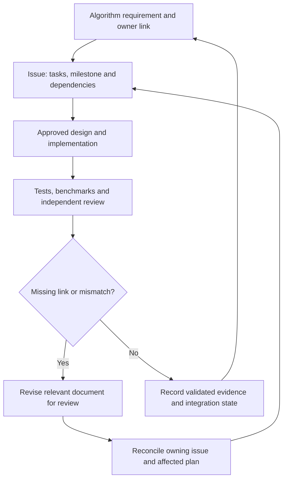

# Linear Regression — OLS requirements and issue lifecycle

**PREPARATION PACKET v5 — live issue reconciliation, 2026-10-06.** This packet combines the OLS teaching README prototype, four detailed workstream bodies, the document–issue lifecycle and a bounded folder-preparation plan. It follows `FEATURE_DEVELOPMENT.md`. The user authorized preparation and the planned issue actions in chat; the technical fitting design and new algorithm implementation still require review. No commit, push, PR, merge or closure authorization is implied.

**Repository evidence checkpoint (freshly verified 2026-10-06):** `rust-development` @ `61bca3156997b90671599fbeb48121c8284be899`; `main` @ `cf95cd08b7f6b87b1d116acdbd947bc3ff92c10b`. The branch comparison is diverged (development 15 commits ahead, 2 behind). Do not merge/rebase to synchronize ancestry. The supplied-parameter predictor exists; OLS fitting/artifact/publication workflow and the proposed OLS folder are absent from the inspected remote tree.

## How to use this document

Read Part I for the algorithm contract and verified requirement owners, Part II for the reconciled live issue snapshots, Part III for the lifecycle, and Part IV for the exact repository map and bounded preparation tasks.

**Verified GitHub access:** connector identity `boyboi86`; repository permissions include admin/pull/push/triage. GitHub override is **Allow all actions**; global default is **Allow low-risk actions**; this session declares approval policy **never**. The authorized state-only patch submitted `state=open` to #23 and succeeded; a fresh read confirmed its body, title and metadata were unchanged. This demonstrates access for that operation, not the cause of the prior restriction being resolved or authorization for Git actions.

**Verified issue state:** #23 and #43–#46 are open. The native sub-issue API returns exactly #43, #44, #45 and #46 under #23. Parent Type is Feature; children Type is Task; all use milestone #3. Their bodies declare Planning, which is not a verified Project-board field. An all-state inventory contained 35 non-PR issues; no additional OLS fitting owner was identified. The existing four children were created before this reconciliation turn; this turn did not create or reopen them.

**Canonical repository destination (PLANNED):** move the downloaded repository-root input `LINEAR_REGRESSION_REVIEW_PACKET.md` to `src/models/linear/ols/README.md`, renaming it to README.md. That path is not yet present at the remote checkpoint. Preserve the full reviewed contract and issue mappings; Parts II–IV remain its issue/design/preparation appendices. Keep one algorithm-local canonical document and no duplicate root/docs packet. The general guides retain `docs/STREAMING_ML_DESIGN.md` and `docs/CORRECTNESS.md` as their destinations.

| Requirement owner | Verified responsibility |
|---|---|
| [#23](https://github.com/Skybrique/seqvex/issues/23) | Scope/design decisions, architecture boundaries, overall acceptance and separately authorized integration/closure |
| [#43](https://github.com/Skybrique/seqvex/issues/43) | Fitting/lifecycle, diagnostics, artifacts/recovery/API, local migration, ordinary tests and documentation |
| [#44](https://github.com/Skybrique/seqvex/issues/44) | Independent mathematics, rank/conditioning, conversion and numerical validation |
| [#45](https://github.com/Skybrique/seqvex/issues/45) | Temporal eligibility/causality, sequential/non-IID and regime-shift validation |
| [#46](https://github.com/Skybrique/seqvex/issues/46) | Latency/throughput, allocations/allocator bytes, memory/scaling/tails, profiling and before/after audits |

Issue links indicate ownership, not completion. Documentation is required within each workstream; no separate documentation child is needed.

**Source availability:** no repository AGENTS.md appears in the inspected remote tree. The ChatGPT project AGENTS.md protects `sources/`; KiloCode must separately inspect all applicable instructions in the actual checkout. Neither general guide is present remotely. Current discussion drafts were read by stable identity (STREAMING_ML_DESIGN text v4 / saved version 6; CORRECTNESS text v1). Actual local checkout copies and working-tree state remain unverified. Preserve them; do not silently create or rewrite a missing standing guide.

**Preparation verification limit:** no code move, fitter, Rust test or benchmark was executed in this review. The handoff forbids benchmark execution. Because `cargo test --all-targets` can run the custom `harness=false` benchmark binaries, Part IV uses benchmark-free test execution and compile-only target checks; the standing all-target execution gate remains NOT RUN/deferred, not waived.

**Review scope:** dense, unweighted, single-target OLS; optional intercept; frozen prediction and periodic refitting. Single-target means one numeric output from multiple input features. This is the agreed trial direction; numerical/API/resource decisions remain subject to the final technical design review. Ridge, Lasso, logistic classification and RLS retain separate algorithm/task contracts. **([#23](https://github.com/Skybrique/seqvex/issues/23))**

---

# Part I — OLS algorithm README prototype

## 1. What this algorithm provides

OLS learns a linear predictor from a declared training dataset. For a new feature vector, the fitted predictor produces one numeric estimate.

**Illustrative quant use:** fit a relationship between features known at an observation's origin and a specified future return, then stream predictions using fixed coefficients until an explicitly accepted refit replaces them. The application defines the features, target horizon and business acceptance; this example is not a profitability claim.

| Capability | At the inspected checkpoint | Requirement / owner |
|---|---|---|
| Predict with supplied weights and bias | Implemented | Preserve the public prediction contract. ([#43](https://github.com/Skybrique/seqvex/issues/43)) |
| Streaming and caller-bounded grouped prediction | Implemented | Demonstrate both paths with fitted parameters. ([#43](https://github.com/Skybrique/seqvex/issues/43)) |
| Fit weights/intercept from labelled rows | Not implemented | Add OLS fitting under an approved numerical contract. ([#43](https://github.com/Skybrique/seqvex/issues/43)) |
| Rank/numerical diagnostics | No fitting diagnostics | Define and independently verify solver outcomes. ([#44](https://github.com/Skybrique/seqvex/issues/44)) |
| Causal periodic refitting | No fitting workflow | Demonstrate eligible training windows and training-only transformations. ([#45](https://github.com/Skybrique/seqvex/issues/45)) |
| Artifact import/export and replacement boundary | No versioned artifact/handoff contract | Add the approved minimum recoverable model contract. ([#43](https://github.com/Skybrique/seqvex/issues/43)) |

“Complete OLS” here includes the necessary fitting, prediction, failure, validation and documentation components. It does not include a generic trainer, model registry, market-data service or trading engine. Sparse, weighted and multi-output fitting are excluded unless explicitly added to scope. **([#23](https://github.com/Skybrique/seqvex/issues/23))**

## 2. Existing prediction API and proposed user flow

This example uses the existing API, not a proposed fitting interface:

```rust
use seqvex::foundation::numerical::Vector;
use seqvex::models::classic::{LinearRegression, RegressionError};

fn main() -> Result<(), RegressionError> {
    let model = LinearRegression::new(
        Vector::from_slice(&[1.0, 2.0]),
        0.5,
    )?;
    let prediction = model.predict(&Vector::from_slice(&[3.0, 4.0]))?;
    assert_eq!(prediction, 11.5);
    Ok(())
}
```

The API was checked against source in v1; this example was not compiled for either draft. Existing `weights()` and `bias()` expose parameters but do not establish a durable artifact format. Historical implementation owner: [#23](https://github.com/Skybrique/seqvex/issues/23).

- Define fitting inputs as \(N\) rows of \(d\) features and \(N\) numeric targets, with explicit ownership and shape validation. **([#43](https://github.com/Skybrique/seqvex/issues/43))**
- Provide the approved concrete path from fitting result and diagnostics to an immutable predictor; do not invent a public `fit` API before its design is accepted. **([#43](https://github.com/Skybrique/seqvex/issues/43))**
- Supply a working example covering fit → inspect → validate → predict → export/import when needed; document inputs, outputs and errors beside the actual API. **([#43](https://github.com/Skybrique/seqvex/issues/43))**
- Keep existing imports compatible during any local reorganization, or obtain explicit approval for a compatibility change. **([#43](https://github.com/Skybrique/seqvex/issues/43))**

## 3. OLS mathematics and numerical envelope

For \(X\in\mathbb R^{N\times d}\), targets \(y\in\mathbb R^N\), weights \(w\in\mathbb R^d\) and an enabled intercept \(b\),

\[
\min_{w,b} \sum_{i=1}^{N}(y_i-b-x_i^\top w)^2,
\qquad
\hat y_i=b+x_i^\top w.
\]

With no intercept, \(b=0\). Equivalently, append a column of ones to obtain \(A=[\mathbf 1\ X]\) and solve \(\min_\theta\|y-A\theta\|_2^2\). An enabled intercept therefore adds a coefficient and can make an existing constant feature redundant.

- Fix the exact objective, intercept handling, precision and supported rank envelope in the technical design. Unweighted OLS must not silently acquire a ridge penalty, feature dropping or sample weighting. **([#23](https://github.com/Skybrique/seqvex/issues/23))**
- Compare a rank-aware QR approach and SVD-based least squares for stability, diagnostics, dependency/resource cost and reversal cost. Choose one justified baseline; explicitly forming and inverting \(X^\top X\) is not the default proposal. **([#23](https://github.com/Skybrique/seqvex/issues/23))**
- Define whether rank-deficient/underdetermined inputs receive a documented solution policy or an explicit error. Publish the numerical rank threshold and its scale/precision interpretation. Do not describe a non-unique solution as uniquely identified coefficients. **([#23](https://github.com/Skybrique/seqvex/issues/23))**
- Implement and report the accepted rank/outcome policy, residual diagnostics and relevant numerical failures. A condition estimate is included only if the chosen method supports a meaningful estimate. **([#43](https://github.com/Skybrique/seqvex/issues/43))**
- Verify the selected solver and numerical boundary independently, including nearly dependent features and training-to-prediction conversion. **([#44](https://github.com/Skybrique/seqvex/issues/44))**

**Existing predictor boundary:** weights/features are `f32`; the dot product reduces in weight-index order. Finite operands can produce infinity/NaN through overflow, and prediction does not check output finiteness. That behavior is documented in the current source.

- Preserve required bitwise equivalence across existing prediction paths. Fitting comparisons use separately justified, conditioning-aware tolerances. **([#44](https://github.com/Skybrique/seqvex/issues/44))**
- If fitting uses another precision, specify conversion and validate the resulting `f32` parameters/predictions. A stricter workflow-level finite-result policy must be explicit; it must not silently change the old predictor API. **([#43](https://github.com/Skybrique/seqvex/issues/43))**

## 4. Data assumptions and non-IID suitability

Calculating an OLS solution does not require IID rows. It also does not establish stable predictive performance under drift or validate conventional uncertainty estimates. Confidence intervals and hypothesis-testing APIs are outside this delivery.

- Define feature schema/order, target meaning, label horizon and availability rules for each temporal example. The OLS solver need not itself own market timestamps; the workflow must nevertheless demonstrate eligibility correctly. **([#45](https://github.com/Skybrique/seqvex/issues/45))**
- Train only on rows whose features and labels are available at the declared cutoff. Fit preprocessing on eligible training rows and use the corresponding transformation at prediction time. **([#45](https://github.com/Skybrique/seqvex/issues/45))**
- Use chronological/walk-forward evaluation; account for overlapping label intervals when they create leakage. Purging/embargo parameters must follow the target construction, not an unexplained universal gap. **([#45](https://github.com/Skybrique/seqvex/issues/45))**
- Test correlated features, serially dependent observations, repeated rows, scale changes and abrupt/gradual regime changes. Separate numerical solvability from predictive usefulness. **([#45](https://github.com/Skybrique/seqvex/issues/45))**
- Keep algebraic row-permutation tests distinct from a production decision to shuffle observations. Mathematical permutation invariance does not authorize shuffled temporal evaluation or guarantee bitwise-identical fitted coefficients. **([#44](https://github.com/Skybrique/seqvex/issues/44))**

## 5. Fitting and refitting lifecycle

The proposed OLS lifecycle is: validate an eligible training window → fit a candidate → inspect diagnostics → evaluate → explicitly accept/install. Serving predictions do not train the model.

- Validate empty inputs, zero features, mismatched row/target counts, inconsistent dimensions and non-finite features/targets before accepting a candidate. Declare validation order and errors. **([#43](https://github.com/Skybrique/seqvex/issues/43))**
- Define dataset retention, solver passes and fit-time capacity. Delivering rows in bounded chunks does not by itself bound total training memory or make this an incremental estimator. **([#43](https://github.com/Skybrique/seqvex/issues/43))**
- Treat periodic refitting as fitting a new candidate under a new declared cutoff. Do not mutate the active model while a candidate is being computed or checked. **([#43](https://github.com/Skybrique/seqvex/issues/43))**
- Demonstrate refitting with training-only transformations and an eligible window, keeping evaluation information out of fitting. **([#45](https://github.com/Skybrique/seqvex/issues/45))**
- Document what reset means: existing executor reset concerns last-prediction state; it does not erase/retrain coefficients. RLS-style observation-by-observation learning remains a separate algorithm. **([#43](https://github.com/Skybrique/seqvex/issues/43))**

Promotion schedules, durable storage and business acceptance are application-owned. The library's replacement and artifact consistency contract must still be defined and tested. **([#23](https://github.com/Skybrique/seqvex/issues/23))**

## 6. Streaming, micro-batching and composition

**Existing behavior:** `predict_batch` operates on the caller's supplied slice, returns outputs in input order, performs a sequential map and allocates an output vector. It has no internal queue, timeout, buffer-fill trigger or maximum-batch configuration. Empty input returns an empty vector; the first invalid observation returns an error without a partial output vector.

- Preserve one-observation prediction as the primitive and test fitted models through the streaming executor. State remains the last committed prediction, not learned coefficients. **([#43](https://github.com/Skybrique/seqvex/issues/43))**
- For a group of \(B\) observations, return \(B\) predictions in input order on success, with the existing single-prediction semantics. One grouped call still contains \(B\) observations. **([#43](https://github.com/Skybrique/seqvex/issues/43))**
- Verify repeated-single, streaming and grouped predictions against the reference, including empty groups, invalid observations and continuation after failure. **([#44](https://github.com/Skybrique/seqvex/issues/44))**
- Define feature transformation → predictor → evaluator composition and ensure the installed predictor uses the intended transformation/schema. Avoid a generalized pipeline framework until concrete requirements justify it. **([#43](https://github.com/Skybrique/seqvex/issues/43))**
- If training ingestion is chunked, document its retention/pass mechanics. It must not be presented as \(B\) online learning updates unless a different estimator is explicitly introduced. **([#43](https://github.com/Skybrique/seqvex/issues/43))**

The proposed user workflow prioritizes streaming and bounded micro-batching. Standing architecture also allows larger batches as a secondary capability; this draft does not remove that capability or change critical documentation. Any project-wide narrowing remains an explicit decision. **([#23](https://github.com/Skybrique/seqvex/issues/23))**

## 7. Memory ownership and algorithm locality

The existing predictor owns immutable weights/bias and needs no mutable prediction workspace. Solver input storage, fitting workspace and serving state are different ownership domains.

- Keep fitted parameters immutable during prediction; give mutable fitting resources a separate, declared owner. Do not introduce model-owned serving scratch merely to reuse fit-time memory. **([#43](https://github.com/Skybrique/seqvex/issues/43))**
- Declare input retention/copying, factorization workspace, output storage and temporary overlap between old/candidate models. Preallocate repeated inner-loop workspace where useful; do not claim zero allocations for all fitting or grouped prediction. **([#43](https://github.com/Skybrique/seqvex/issues/43))**
- Measure model/workspace footprint, fitting peak memory and serving/refit overlap separately from allocated-byte traffic. **([#46](https://github.com/Skybrique/seqvex/issues/46))**
- Perform necessary local moves with a before/after module/target map, compatible exports and discoverable tests/benchmarks. Family extraction requires concrete consumers and a demonstrated benefit. **([#43](https://github.com/Skybrique/seqvex/issues/43))**

**Illustrative locality map — proposed paths, not existing files:**

| Level / path | Contents | Owning issue |
|---|---|---|
| `src/models/linear/ols/` | Algorithm files, `mod.rs`, README, examples and local unit/public-contract tests | [#43](https://github.com/Skybrique/seqvex/issues/43) |
| OLS-local test fixtures | Independent analytical/numerical oracles | [#44](https://github.com/Skybrique/seqvex/issues/44) |
| OLS-local workflow fixtures | Temporal eligibility and refitting tests | [#45](https://github.com/Skybrique/seqvex/issues/45) |
| OLS-local `benches/` | Component fitting/prediction/resource measurements | [#46](https://github.com/Skybrique/seqvex/issues/46) |
| Family module/tests/benches | Exports and justified cross-algorithm/shared behavior | [#23](https://github.com/Skybrique/seqvex/issues/23); separate ownership only if independently meaningful |
| Project `tests/`, `benches/` | Cross-component execution/recovery tests and integrated workflow measurements | Respective [#43](https://github.com/Skybrique/seqvex/issues/43), [#45](https://github.com/Skybrique/seqvex/issues/45) or [#46](https://github.com/Skybrique/seqvex/issues/46) owner |

Nested tests/benches need explicit module/Cargo registration or root wrappers. Verify discovery and execution; placement alone is not sufficient. Shared benchmark infrastructure remains shared, not a runtime dependency. **([#43](https://github.com/Skybrique/seqvex/issues/43))**

## 8. Failure, recovery and explicit assumptions

Use [`FAILURE_AND_RECOVERY.md`](https://github.com/Skybrique/seqvex/blob/61bca3156997b90671599fbeb48121c8284be899/docs/FAILURE_AND_RECOVERY.md) as the standing reference.

| Failure / boundary | Required OLS behavior | Owner |
|---|---|---|
| Invalid training shape/value | Explicit error; no usable candidate claimed | [#43](https://github.com/Skybrique/seqvex/issues/43) |
| Rank/conditioning outside support | Defined error or approved solution policy; no silent regularization | [#43](https://github.com/Skybrique/seqvex/issues/43) |
| Fit or candidate checks fail | Active predictor remains unchanged | [#43](https://github.com/Skybrique/seqvex/issues/43) |
| Import is malformed/incompatible | Reject before installation; preserve active model | [#43](https://github.com/Skybrique/seqvex/issues/43) |
| Model/transform pair mismatches | Reject or prevent incoherent publication under the approved schema | [#43](https://github.com/Skybrique/seqvex/issues/43) |
| Prediction/group fails | Preserve the existing committed-state/partial-output contract | [#43](https://github.com/Skybrique/seqvex/issues/43) |
| Training row contains unavailable information | Exclude/reject it under the declared workflow policy and test that policy | [#45](https://github.com/Skybrique/seqvex/issues/45) |

- Define the minimum artifact: approved format/version, coefficients/intercept, dimensions, feature-order/schema information and necessary transformation/version linkage. Document encoding precision and validate before accepting it. No durable storage service is implied. **([#43](https://github.com/Skybrique/seqvex/issues/43))**
- Specify when a new model becomes active and which model/transform version serves in-flight observations. Do not invent a scheduler, lock-free publication mechanism or process-wide synchronization API to solve this before design review. **([#23](https://github.com/Skybrique/seqvex/issues/23))**
- Define retry/resume guarantees and committed progress. A retry must not accidentally install or process the same operation twice where that has observable effects. **([#43](https://github.com/Skybrique/seqvex/issues/43))**
- State allocation/capacity failure limits, including what can be returned as an error and what the runtime may terminate on. Do not claim that all OOM, panic or hardware failures are recoverable. **([#43](https://github.com/Skybrique/seqvex/issues/43))**
- Independently test the material numerical failure outcomes and report limitations of those checks. **([#44](https://github.com/Skybrique/seqvex/issues/44))**

Assumptions: the application supplies trustworthy feature/label availability, owns storage/supervision and chooses promotion policy. Any contradiction with the standing failure contract is surfaced before affected implementation continues. **([#23](https://github.com/Skybrique/seqvex/issues/23))**

## 9. Independent mathematical and temporal verification

**Analytical examples for planned tests, not measurements from an implemented fitter:**

- With intercept, \(x=(0,1,2)\), \(y=(1,3,5)\): \(w=2,\ b=1\), squared residual sum \(0\). **([#44](https://github.com/Skybrique/seqvex/issues/44))**
- With intercept, \(x=(0,1,2)\), \(y=(1,2,2)\): \(w=1/2,\ b=7/6\), squared residual sum \(1/6\). This tests a nonzero-residual fit rather than only exact synthetic lines. **([#44](https://github.com/Skybrique/seqvex/issues/44))**

For a nonconstant single feature, an independent scalar control can use
\[
w=\frac{\sum_i(x_i-\bar x)(y_i-\bar y)}
        {\sum_i(x_i-\bar x)^2},\qquad b=\bar y-w\bar x.
\]
The zero-denominator case requires the declared rank policy.

| Verification | OLS-specific evidence | Owner |
|---|---|---|
| General solution | Independent reference/oracle with matched objective, intercept, rank policy and precision; residual/optimality checks supplement it | [#44](https://github.com/Skybrique/seqvex/issues/44) |
| Rank/numerics | Duplicate columns, constant feature plus intercept, \(N\) below coefficient count, nearly dependent columns, scale extremes and conversion boundaries | [#44](https://github.com/Skybrique/seqvex/issues/44) |
| Prediction regression | Existing reduction order, public imports, dimension/finiteness checks and single/stream/group equivalence | [#44](https://github.com/Skybrique/seqvex/issues/44) |
| Temporal eligibility | Labels unavailable at cutoff excluded; transformations fitted on training only; overlap handled where applicable | [#45](https://github.com/Skybrique/seqvex/issues/45) |
| Regime behavior | Autocorrelated rows, abrupt/gradual coefficient changes, repeated rows and correlated features; comparisons/limitations reported | [#45](https://github.com/Skybrique/seqvex/issues/45) |
| Code/runtime behavior | API errors, artifact validation, failed candidate preservation and defined replacement/retry outcomes | [#43](https://github.com/Skybrique/seqvex/issues/43) |

- Report actual tested revisions, commands, results and tolerance rationale. Existing predictor tests and historical [#27](https://github.com/Skybrique/seqvex/issues/27) evidence do not validate the new fitter. **([#44](https://github.com/Skybrique/seqvex/issues/44))**
- Keep mathematical correctness, leakage prevention and predictive usefulness distinct; a passing oracle comparison cannot substitute for temporal workflow evidence. **([#45](https://github.com/Skybrique/seqvex/issues/45))**

## 10. OLS performance and optimization evidence

**Proposed initial workload selection, subject to approved resource budgets:**

| Operation | Proposed scaling variables | Evidence needed | Owner |
|---|---|---|---|
| Fit | \(N=\{1{,}024,16{,}384\}\), \(d=\{8,32,128\}\); full-rank baseline plus representative conditioning cases | Fit latency, allocation/bytes, retained/peak workspace and scaling | [#46](https://github.com/Skybrique/seqvex/issues/46) |
| Streaming prediction | \(d=\{8,32,128\}\), fixed model | Warm latency distribution, throughput and allocation/bytes | [#46](https://github.com/Skybrique/seqvex/issues/46) |
| Grouped prediction | Same dimensions; \(B=\{1,8,32,128\}\) | Per-observation and per-call costs, output allocation, batch-size effect | [#46](https://github.com/Skybrique/seqvex/issues/46) |
| Import/refit handoff | Representative model/schema sizes | Cold-path cost and old/candidate overlap, separate from serving compute | [#46](https://github.com/Skybrique/seqvex/issues/46) |
| Integrated workflow | Transform → predict → evaluate; refit scenario where supported | Whole-path latency/resource cost and relevant completion behavior | [#46](https://github.com/Skybrique/seqvex/issues/46) |

These values are candidates, not a required blind Cartesian sweep or newly collected evidence.

- Agree representative workload, capacity and latency/resource acceptance before claiming production readiness. **([#23](https://github.com/Skybrique/seqvex/issues/23))**
- Record release distributions, throughput, allocations and allocated bytes, model/fit/serving memory, scaling, raw provenance and limitations. Separate cold fitting/import from steady-state serving. **([#46](https://github.com/Skybrique/seqvex/issues/46))**
- Normalize observation/group work explicitly; allocator traffic is not live/peak memory. Report request tails only from a suitable request-level sampling method, not from normalized-window p95/p99. **([#46](https://github.com/Skybrique/seqvex/issues/46))**
- Use correctness guards outside timing and retain revision/toolchain/hardware/resource facts and justified repeat methodology. Historical #23 prediction evidence is not a new fitting or workflow benchmark. **([#46](https://github.com/Skybrique/seqvex/issues/46))**
- Audit avoidable copying/allocation, fitting workspace reuse, prediction hot loops and independent multicore opportunities before proposing optimization. Check numerical order, ownership, capacities and future layout/device compatibility. **([#46](https://github.com/Skybrique/seqvex/issues/46))**
- Keep reference semantics intact; any SIMD/parallel reduction, new precision, custom allocator, build profile or hardware backend requires its own justified design/evidence. CPU/software opportunities precede layout/device work; GPU remains later. No optimization is authorized by this measurement child. **([#23](https://github.com/Skybrique/seqvex/issues/23))**


### Ownership of later optimization — keep four workstreams

| Concern | Primary owner | Supporting verification |
|---|---|---|
| Approved Rust/process/CPU optimization code for OLS, local workspace reuse or independent execution | [#43](https://github.com/Skybrique/seqvex/issues/43) | [#46](https://github.com/Skybrique/seqvex/issues/46) establishes bottleneck and before/after evidence |
| Floating-point order, precision, rank or coefficient changes | [#44](https://github.com/Skybrique/seqvex/issues/44) | Implementation supplies code; #23 approves any contract change |
| Ordering, availability or refit/recovery effects | [#45](https://github.com/Skybrique/seqvex/issues/45) | Implementation supplies the affected workflow |
| New public/shared device, synchronization, allocator or storage architecture | [#23](https://github.com/Skybrique/seqvex/issues/23) for the decision | Propose separate ownership only for an independently meaningful new objective/architecture |

A deployment contract describes accepted behavior and limits; it is not the default container for every optimization issue. Retain tasks in these four workstreams where objective and category match. Correctness, measured bottleneck, applicable critical architecture review, explicit implementation authorization and after-change evidence remain necessary (§33.3).

The opportunity audit must examine allocations/copies, bounded capacities, exclusive mutable resources, independent work, CPU utilization, numerical reductions and layout/device assumptions. “Zero-cost abstraction” is a design/property claim to verify in the compiled hot path, not a promised total cost. Send/Sync express thread-safety contracts; they do not introduce blocking. Async scheduling is not itself parallel computation. Independent predictions may be candidates for CPU parallelism, while within-stream dependent updates remain ordered. No Rayon, SIMD, allocator, layout or profile implementation is part of folder preparation.

The current crate forbids unsafe code, while standing policy permits justified low-level unsafe under review. No lint, allocator or panic-policy change is proposed. **([#23](https://github.com/Skybrique/seqvex/issues/23))**

## 11. Practical temporal example and edge cases

**Illustrative eligibility example:** target = two-observation-ahead return; refit cutoff = after the close of observation 100. This table demonstrates availability only, not a sufficient training dataset.

| Feature origin | Features available | Target becomes available | Eligible at cutoff 100? | Validation owner |
|---|---:|---:|---|---|
| 98 | 98 | 100 | Yes | [#45](https://github.com/Skybrique/seqvex/issues/45) |
| 99 | 99 | 101 | No | [#45](https://github.com/Skybrique/seqvex/issues/45) |
| 100 | 100 | 102 | No | [#45](https://github.com/Skybrique/seqvex/issues/45) |

- Turn this timeline into a positive eligibility test and a negative leakage control; use explicit event/availability semantics rather than assuming sorted rows are enough. **([#45](https://github.com/Skybrique/seqvex/issues/45))**
- Provide chronological evaluation with an explicit baseline and suitable prediction-error metric. If \(R^2\) is offered, define constant-target behavior; do not silently hide undefined metrics. A local example need not create a generic metrics framework. **([#45](https://github.com/Skybrique/seqvex/issues/45))**
- Document what users should do for invalid shape, non-finite input, constant/duplicate features, inadequate rows, incompatible schema and failed refits, using the actual supported errors/outcomes. **([#43](https://github.com/Skybrique/seqvex/issues/43))**
- Explain that periodic refitting can adapt a candidate to a newer window but does not guarantee improved future performance or automatic regime robustness. **([#45](https://github.com/Skybrique/seqvex/issues/45))**

## 12. README maintenance and completion links

- Keep scope/API/fitting/execution/failure/examples accurate with the implementation delivery and link its tested revision. Rustdoc and working examples are part of the same workstream. **([#43](https://github.com/Skybrique/seqvex/issues/43))**
- Maintain mathematical formulas, tolerances, rank policy, oracle links and numerical limits beside the independent evidence. **([#44](https://github.com/Skybrique/seqvex/issues/44))**
- Maintain temporal assumptions, eligibility examples, regimes and evaluation limitations beside their evidence. **([#45](https://github.com/Skybrique/seqvex/issues/45))**
- Maintain performance tables, workload/provenance links and memory distinctions beside the measurement delivery. **([#46](https://github.com/Skybrique/seqvex/issues/46))**
- Maintain the parent acceptance/dependency/milestone map and final integration review. A linked issue alone is not proof that its requirement is implemented or validated. **([#23](https://github.com/Skybrique/seqvex/issues/23))**

The 12 sections cover the runbook's 17 README topics: algorithm/problem, mathematics, assumptions/regimes, learning, execution/state, streaming/grouping, validation, performance/memory, API/examples, limitations and edge cases.

---

# Part II — reconciled issue records and completion ownership

**Live snapshots, verified after body updates on 2026-10-06.** These preserve the current #23 history rather than substituting an old parent draft. They are issue records and planned requirements, not implementation evidence. Subsequent live issue decisions require fresh reconciliation.

| Issue | State/type | Native relationship | Documentation/evidence owner | Reconciliation outcome |
|---|---|---|---|---|
| #23 | Open / Feature | Parent of #43–#46 | Scope, design, acceptance and integration | Historical prediction scope retained; planned README destination and written-stage boundary clarified |
| #43 | Open / Task | Child of #23 | API, lifecycle, errors, examples and local migration | Existing scope retained; fitting error precedence remains design-pending; benchmark-free preparation checks clarified |
| #44 | Open / Task | Child of #23 | Mathematics, tolerances, rank, oracle and numerical limits | Existing scope retained; explicit §12 documentation acceptance added |
| #45 | Open / Task | Child of #23 | Availability, assumptions, regimes and temporal limits | Existing scope retained; explicit §12 documentation acceptance added |
| #46 | Open / Task | Child of #23 | Performance tables, provenance, memory and measurement limits | Existing scope retained; explicit §12 documentation acceptance added |

All states, labels, assignees, milestone and native relationships were preserved. No additional issue was needed. #27 is related historical audit evidence; #28 is existing shared benchmark infrastructure. Neither replaces the new fitter's own acceptance evidence.

## #23 — Establish Linear Regression streaming and micro-batch execution

## Objective

Establish Linear Regression as the first classical-ML vertical slice and use it to test whether Seqvex's execution model generalizes beyond recurrent neural networks.

The issue covers the basic/reference algorithm plus the first two concrete execution strategies: streaming and bounded micro-batching.

**GitHub Issue Type intended: Feature**

## Scope

### Reference/basic algorithm

Implement a minimal, mathematically transparent Linear Regression model suitable for Seqvex's sequential execution experiments.

Establish:

- parameter representation;
- prediction;
- input/dimension validation;
- numerical behavior;
- deterministic reference tests.

Regression is the initial task formulation. Do not create a separate classification abstraction merely because a related linear score could later support classification.

### Streaming

Provide ordered single-observation execution suitable for repeated inference and, where the chosen slice requires it, clearly separate prediction from any parameter-update operation.

### Micro-batching

Provide bounded micro-batch execution over the same model semantics.

For this algorithm, micro-batching may expose useful independent computation across observations. Do not assume a particular vectorized kernel before measurement.

### Validation and measurement

Compare streaming and micro-batch behavior for:

- numerical equivalence;
- ordering;
- failure behavior;
- latency;
- throughput;
- allocations/bytes;
- workspace/memory behavior;
- batch-size sensitivity.

## Constraints

Do NOT:

- build a generalized supervised-learning trait hierarchy;
- build a generalized batch scheduler;
- introduce automatic execution selection;
- introduce a generalized workspace abstraction;
- add GPU/SIMD/unsafe optimization before profiling;
- turn this issue into a complete training framework.

CPU optimization follows execution coverage and profiling.

## Acceptance criteria

- Reference implementation is independently testable.
- Streaming execution is implemented and tested.
- Bounded micro-batch execution is implemented and tested.
- Both paths preserve the defined numerical contract.
- Representative batch sizes are measured.
- Allocation and latency results are recorded separately.
- Any recurring abstraction requirement is documented rather than generalized prematurely.
- fmt, tests, and Clippy pass.


---

## OLS extension — reopened 2026-10-06

**Status:** Reopened to extend the completed prediction slice with OLS fitting and periodic refitting, per the approved locality plan whose canonical destination is `src/models/linear/ols/README.md` (not yet present at the verified remote checkpoint). The original objective, scope and completion record above are preserved unchanged as the historical prediction record.

**Objective:** deliver the approved minimum complete dense, single-target, unweighted OLS fitting-to-streaming workflow, building on the completed supplied-parameter prediction slice.

**Parent of (native children, verified through the sub-issues API):**

- #43 — Implement OLS fitting and deployment contract.
- #44 — Independently validate OLS mathematics and numerical behavior.
- #45 — Validate OLS refitting on sequential and non-IID data.
- #46 — Audit OLS fitting and prediction latency, allocation and memory.

**Mathematical/technical contract:** Part I §§3–8 of the OLS README, finalized by the approved technical design; preserve existing prediction compatibility and document fitting/rank/precision/failure boundaries. The technical fitting design is a proposal requiring Maintainer approval before implementation.

**Alternatives considered:** rank-aware pivoted QR baseline versus SVD least squares; defined rank rejection versus minimum-norm support; f64 fitting workspace versus the current f32 predictor substrate; caller-owned data versus necessary retained solver input; concrete artifact/handoff versus a premature generic registry. Record the chosen approach, rejected alternatives, evidence and reversal costs in the parent design record.

**Workstreams and repository map:**

- Fitting, diagnostics, artifact/handoff, existing prediction integration and local migration map — #43.
- Independent OLS oracle, rank/conditioning and prediction-contract verification — #44.
- Eligible refit windows, training-only transformations and temporal/regime fixtures — #45.
- Local component benchmarks and integrated fitting/serving resource evidence — #46.
- Overall README completeness, shared dependencies and feature integration — #23.

**Risks:** poor conditioning, accidental numerical-semantic changes, input retention/fit peaks, incoherent transform/model replacement, leakage, recovery assumptions and speculative abstraction. Route each discovery to the relevant document passage and owning issue; contract conflicts require resolution before affected implementation continues.

**Deferred decisions requiring resolution before affected implementation:** solver/dependency, precision/rank policy, public fitting API, resource envelope, artifact schema, replacement/retry boundary and temporal/performance acceptance. Future algorithm variants and device/runtime frameworks remain out of scope.

**Acceptance criteria and owners:**

- Approve OLS objective, intercept, numerical/rank/data envelope and material architecture/API decisions — #23.
- Implement fitting, approved diagnostics and immutable predictor construction; validate shape/value/rank failures — #43.
- Implement the minimum artifact and coherent replacement/recovery behavior; preserve serving state on failed candidate operations — #43.
- Independently validate coefficients/residuals, numerical edge cases, conversion and required prediction equivalence — #44.
- Validate eligible temporal fitting/refitting, transformation boundaries and declared non-IID regimes — #45.
- Record release latency/throughput, allocations/bytes, fitting/serving memory, scaling and relevant tails with provenance/limitations — #46.
- Pass required Rust checks for the code delivery; deliver usable README/rustdoc and practical API examples — #43.
- Resolve independent mathematical review findings and document the tested numerical envelope — #44.
- Resolve applicable architecture and independent code-review findings; verify required children, documentation, integration and final parent completion before separately authorized closure — #23.

**Classification:** Type Feature (set through the supported issue-type metadata operation); existing labels `enhancement`, `experimental`, `area::execution` and milestone #3 preserved. Area/label review for the expanded scope is deferred to Maintainer approval.

All four issue bodies declare **Planning**; the technical design review remains pending. This describes the written stage, not a verified GitHub Project-board status. Passing folder-preparation checks does not constitute mathematical acceptance of a fitter that does not yet exist.


---

## #43 — Implement OLS fitting and deployment contract

## Parent

Native sub-issue of #23 (native linkage established and read back after creation). Canonical design and task-plan destination: `src/models/linear/ols/README.md`. At remote `rust-development` @ `61bca3156997b90671599fbeb48121c8284be899`, this path is not yet present; the reviewed packet is the preparation input. Folder preparation must place that packet there and leave one canonical README.

## Stage

**Planning** — technical design review pending. This body records the approved preparation scope; it does not authorize implementation on its own.

## Category

Implementation.

## Objective

Make the approved dense, single-target, unweighted OLS fitting-to-prediction contract usable, building on the completed supplied-parameter prediction slice.

## Scope / planned change

Implement the requirements owned by this workstream in Part I §§2–8 and 11–12 of the canonical OLS README:

- OLS fitting and rank/numerical diagnostics under the approved numerical contract;
- input validation covering empty inputs, zero features, mismatched row/target counts, inconsistent dimensions and non-finite features/targets; finalize fitting error precedence in the approved technical design;
- construction of an immutable predictor from a validated fit result (weights + intercept), with no silent regularization, feature dropping or sample weighting;
- minimal versioned artifact validation/import/export: encoding/version/limits, coefficients/intercept, dimensions, feature order/schema and transform linkage; reject malformed/truncated/incompatible input before installation;
- candidate acceptance/recovery: the active predictor remains unchanged on failed fit or import; document the in-flight version policy, retry expectations and supervision boundary;
- streaming and bounded grouped prediction integration with fitted parameters;
- local module/test/benchmark wiring, ordinary code tests and teaching examples;
- carry the approved local migration and any later approved same-objective optimization code in this workstream. Do not open a child issue per refactor, loop, execution mode or optimization stage.

## Evidence required

Working API/example; fit and diagnostic fixtures; candidate/import/retry failure tests; existing predictor regression tests; Cargo target discovery; required build/test/fmt/Clippy/MSRV results.

## Planned Rust checks (NOT RUN yet; later implementation scope)

`cargo fmt --all -- --check`; `cargo build --locked --all-targets --all-features -j 2`; `cargo test --locked --all-targets --all-features -j 2`; `cargo clippy --locked --all-targets --all-features -j 2 -- -D warnings`; `cargo +1.85.1 test --locked --all-targets --all-features -j 2`.

Folder-preparation authorization excludes benchmark execution. For that preparation, use `cargo test --locked --all-features --lib --tests --examples -j 2` and its Rust 1.85.1 equivalent, plus `cargo build --locked --all-targets --all-features -j 2`, Clippy and benchmark `--no-run`. `cargo test --all-targets` can execute the current `harness=false` benchmark binaries; defer those all-target execution checks until separately authorized and report the gap. This does not amend CI or the standing development contract.

## Acceptance criteria

All linked implementation requirements satisfied; no silent numerical repair; documented resource/error boundaries; existing prediction compatibility preserved or explicitly approved; README/rustdoc match actual behavior.

Maintain README/rustdoc, migration/current API facts, errors, lifecycle and practical examples for this workstream (Part I §12).

## Dependencies

Approved #23 scope, approved technical design and the applicable critical architecture review; numerical/temporal findings resolved before the corresponding behavior is claimed.

## Classification

Type: Task. Area: unassigned pending an accurate existing classification. Nature: `enhancement`. Milestone: #3 (Sequential ML Slice - Classic ML).

## Why this issue

A coherent code/API/failure deliverable with independent review and the ability to block #23; documentation and local refactor steps stay within it.


---

## #44 — Independently validate OLS mathematics and numerical behavior

## Parent

Native sub-issue of #23 (native linkage established and read back after creation). Canonical design and task-plan destination: `src/models/linear/ols/README.md`. At remote `rust-development` @ `61bca3156997b90671599fbeb48121c8284be899`, this path is not yet present; the reviewed packet is the preparation input. Folder preparation must place that packet there and leave one canonical README.

## Stage

**Planning** — technical design review pending. Controls can be designed before the fitter exists; final evidence requires the executable implementation.

## Category

Mathematical correctness.

## Objective

Independently verify the accepted OLS and prediction numerical contracts.

## Scope / planned change

Linked requirements in Part I §§3, 4, 6, 8, 9 and 12:

- analytic exact and nonzero-residual fits with matched objective, intercept, rank policy and precision;
- an independent oracle (for example a scalar closed-form control for a single feature and a separately justified reference for multiple features), supplementing rather than replacing residual/optimality checks;
- rank and conditioning boundaries: duplicate columns, constant feature plus enabled intercept, row count below coefficient count, nearly dependent columns, scale extremes, and fit-to-prediction `f32` conversion boundaries;
- existing prediction regression: reduction order, public imports, dimension/finiteness checks, and single/stream/group equivalence;
- numerical failure outcomes and the limitations of those checks.

## Evidence required

Matched mathematical controls; tolerance justification distinguishing conditioning-aware fit tolerances from bitwise prediction requirements; supported/rejected boundary fixtures; reproducible revision and commands; scoped audit findings.

## Acceptance criteria

Independent evidence establishes the supported numerical envelope; violations are resolved; fitting tolerance and prediction bitwise requirements are distinguished; no "defect-free everywhere" claim.

Maintain the README mathematics, approved tolerances/rank policy, oracle links, tested revision and numerical limitations for this workstream (Part I §12).

## Dependencies

Approved numerical design; the implementation workstream for final evidence. Analytical controls can be designed beforehand.

## Classification

Type: Task. Area: `area::test`. Nature: none proposed. Milestone: #3 (Sequential ML Slice - Classic ML).

## Why this issue

Distinct mathematical evidence can reject a functional implementation; individual tests remain checklist tasks within this workstream.


---

## #45 — Validate OLS refitting on sequential and non-IID data

## Parent

Native sub-issue of #23 (native linkage established and read back after creation). Canonical design and task-plan destination: `src/models/linear/ols/README.md`. At remote `rust-development` @ `61bca3156997b90671599fbeb48121c8284be899`, this path is not yet present; the reviewed packet is the preparation input. Folder preparation must place that packet there and leave one canonical README.

## Stage

**Planning** — the target/availability example contract and workflow design must be agreed before final validation. Positive/negative fixtures can be specified beforehand.

## Category

Statistical / non-IID validation.

## Objective

Verify causal refitting/evaluation and document supported regime behavior.

## Scope / planned change

Linked requirements in Part I §§4–5, 8–9 and 11–12:

- feature/target availability timelines: only rows whose features and labels are available at the declared cutoff are eligible;
- training-only transformations: fit preprocessing on eligible training rows and apply the corresponding transformation at prediction time;
- chronological/walk-forward evaluation with an explicit baseline and a suitable prediction-error metric (constant-target behavior defined if `R²` is offered);
- overlapping label intervals and purging/embargo handling tied to target construction, not a universal gap;
- positive eligibility test and negative leakage control from the illustrative timeline;
- regime/dependence fixtures: correlated features, serially dependent (AR-like) observations, repeated rows, scale changes, abrupt and gradual shifts;
- keep numerical solvability, leakage prevention and predictive usefulness distinct.

## Evidence required

Inspectable cutoffs; positive and negative leakage controls; explicit baseline/metrics; supported scenarios and limitations; reproducible revision and commands.

## Acceptance criteria

Unavailable information is excluded; the declared fitting/refit workflow holds; regime results and numerical solvability remain distinct; no universal prediction or profitability claim.

Maintain the README availability/eligibility examples, temporal assumptions, evaluated regimes, tested revision and statistical limitations for this workstream (Part I §12).

## Dependencies

Agreed task/horizon example and workflow design; the implementation workstream for final workflow validation. No market-data service or backtester is required.

## Classification

Type: Task. Area: `area::test`. Nature: `experimental` for the explicit validation hypotheses. Milestone: #3 (Sequential ML Slice - Classic ML).

## Why this issue

Causal/regime evidence is distinct from algebra and independently blocks the claimed workflow.


---

## #46 — Audit OLS fitting and prediction latency, allocation and memory

## Parent

Native sub-issue of #23 (native linkage established and read back after creation). Canonical design and task-plan destination: `src/models/linear/ols/README.md`. At remote `rust-development` @ `61bca3156997b90671599fbeb48121c8284be899`, this path is not yet present; the reviewed packet is the preparation input. Folder preparation must place that packet there and leave one canonical README.

## Stage

**Planning** — workload/resource acceptance budgets must be agreed before claims. Harness preparation can proceed earlier within scope.

## Category

Benchmark / allocation / latency audit.

## Objective

Establish release performance/resource evidence for OLS fitting and serving, and audit concrete optimization opportunities.

## Scope / planned change

Linked requirements in Part I §§7, 10 and 12:

- separate cold fit/import cost from steady-state serving;
- fit workloads across representative row counts and feature dimensions, including a full-rank baseline and representative conditioning cases;
- streaming/grouped prediction workloads with per-observation and per-call normalization;
- model/workspace footprint, fitting peak memory and serving/refit overlap, reported separately from allocated-byte traffic;
- record distributions, throughput, allocations and allocated bytes, scaling, raw provenance and repeat limitations;
- audit avoidable copying/allocation, fitting workspace reuse, prediction hot loops and independent multicore opportunities before proposing optimization, checking numerical order, ownership, capacities and future layout/device compatibility.

## Evidence required

Comparable work definitions; correctness guards outside timing; distributions/throughput; allocation/bytes; memory accounting; scaling; raw provenance and repeat limitations.

## Planned benchmark check (NOT RUN yet)

`cargo bench --locked --no-run -j 2`, followed by approved release captures using the final registered OLS benchmark target. No new target name or capture is asserted here.

## Acceptance criteria

Representative cases and budgets assessed; compute versus regime evidence separated; quantities/tails labeled correctly; fitting/cold costs separated from serving; no optimization or universal speedup claimed without its own evidence.

Maintain the README measured performance tables, workload/provenance links, memory distinctions, tested revision and measurement limitations for this workstream (Part I §12).

## Dependencies

Approved workloads/resource targets and stable code; correctness/regime gates precede optimization decisions. Harness preparation can proceed earlier within scope.

## Classification

Type: Task. Area: `area::benchmark`. Nature: none proposed. Milestone: #3 (Sequential ML Slice - Classic ML).

## Why this issue

Operational acceptance is a distinct blocking category; one run or group size is not another issue.


**Review boundary:** these records declare Planning; technical design review and implementation remain pending. Parent Feature/child Task metadata and native relationships were verified through API reads; Project-board status was not inspected. For non-trivial code, an independent Code Reviewer is still required. This packet's author review does not satisfy that gate. **([#23](https://github.com/Skybrique/seqvex/issues/23))**

---

# Part III — documents and issues as the project lifecycle

## The functional loop

The algorithm document explains the requirement and contract. The owning issue manages its tasks, dependencies, milestone and acceptance. Source/tests/benchmarks establish implementation and evidence. Review feeds discoveries back into the appropriate document and issue.



This is a project-management feedback loop, not an alternative approval policy. Proposed corrections remain labelled until approved; critical contract changes receive the required notification/review.

## What each artifact owns

| Artifact | Role | Connection to issues |
|---|---|---|
| `STREAMING_ML_DESIGN.md` | Programme/family direction and boundaries | Links selected algorithm parents and roadmap decisions |
| OLS README / this prototype | Mathematics, user behavior, requirements, limitations and evidence | Each actionable point links its primary owner |
| Issue-linked technical design | Solver/precision/rank, API/ownership, recovery and alternatives | Parent #23 records accepted decisions and affected children |
| Issue-linked implementation plan | Coherent tasks, file/target map, sequence, commands and review handoff | Each task belongs to a parent/child; not a separate issue by default |
| Standing correctness/failure guides | Reusable validation/failure principles | Algorithm evidence applies them; proposed gaps return to the relevant guide owner |
| GitHub parent/children | Approved scope, dependencies, acceptance and actual workflow state | Native hierarchy and existing milestone connect the work |
| Tests/benchmarks/review records | What was actually verified/measured, at which revision | Links back to requirement and owning issue |
| Roadmap/milestone | Sequence and delivery/integration stage across algorithms | References real parents/dependencies; not another issue-ID system |

Keep detailed design/plans issue-linked without creating another Markdown file merely for each small concern. Decide a durable location when the plan is approved; this packet creates no additional repository files.

## When a missing link is discovered

1. **Identify the exact gap:** missing requirement, mathematical ambiguity, failure assumption, task owner, dependency, evidence or stale implementation claim. Link the source/test/review evidence. **([#23](https://github.com/Skybrique/seqvex/issues/23), then the affected child)**
2. **Revise the relevant document first for review:** the OLS passage for a local contract; the programme guide for cross-family direction; the appropriate standing guide for a reusable principle. Keep proposals distinct from accepted behavior. Critical docs are not silently amended. **(Existing document/workstream owner; otherwise ownership proposal under #23)**
3. **Reconcile the owning issue:** link the exact changed passage, reason/evidence, acceptance impact, added/removed tasks, dependencies and affected milestone/sequence. Preserve earlier evidence and its scope. **(Same owning parent/child where objective and category remain the same)**
4. **Update the affected plan and then implement/verify the approved correction:** no new child for one test, rerun or documentation correction. Propose different ownership only when the objective/category becomes independently meaningful. **(Affected child; issue creation/update approval where required)**
5. **Close the loop:** record the tested revision/results, update the README's actual capability/evidence links, and reconcile issue/project/roadmap stage. Delivery completion and integration completion remain different facts. **(Affected child; #23 for overall completion)**

A material contract contradiction is recorded as a blocker and resolved before continuing affected work, following `DEVELOPMENT.md` §24.11–§24.12. Independent work proceeds only within its approved scope and without crossing that boundary.

**OLS example — proposed:** review finds that a constant input column plus enabled intercept produces an undocumented rank outcome. Update §3's rank contract for review; reconcile the implementation child's error/solution tasks and the mathematics child's independent fixture; record the accepted policy in #23's design; correct/test the code; then link the result in both issues and the README. Do not create an issue merely for this one fixture.

## Milestone, sequence and dependency view

**Trial milestone proposal:** use existing #3, **Sequential ML Slice - Classic ML**. Final family roadmap/milestones are reviewed after design; this trial does not create a new milestone or mark the existing one complete.

| Step / checkpoint | Primary owner | Necessary input | Progress shown in issues |
|---|---|---|---|
| Scope and issue action review | #23 | This packet, existing implementation/ownership | Issue reconciliation verified; fitting design review pending |
| Formal OLS design and applicable critical review | #23 | Authorized open parent and approved scope | Decisions/risks recorded; affected children identified |
| Child/task planning | #23 and #43–#46 | Agreed categories; detailed design reviewed before affected implementation | Four IDs, verified native relationships and issue-linked tasks |
| Fit/API/failure implementation | OLS implementation | Design/branch/implementation authorization | Code delivery and required checks |
| Independent numerical evidence | OLS mathematics | Approved contract and executable implementation | Oracle/rank/tolerance findings and acceptance |
| Temporal workflow evidence | OLS sequential validation | Target/availability contract and executable workflow | Leakage/regime findings and acceptance |
| Release resource evidence | OLS performance | Stable code, approved workloads and guards | Captures, limits and budget assessment |
| Final feature review/integration | #23 | Required child evidence and resolved findings | Parent validation, separate integration/closure gates |
| Trial retrospective/template improvement | #23 initially | Completed trial evidence | Proposed visible runbook/process update |

This table is a dependency guide, not a requirement to wait for all code before designing oracles, timelines or benchmark cases. GitHub project stages use the existing **Planning → Implementation → Validation → Integrated** meanings when applicable. No project-board changes are performed here.

The parent normally supplies one feature branch; commits reference the child owning their delivered category. Source placement does not determine whether an issue is a parent, child, dependency or related record.

## Decision register with issue ownership

| Decision needed before affected implementation | Why it matters specifically to OLS | Owner |
|---|---|---|
| Dense/single-target/unweighted scope and intercept | Shapes objective, coefficient count and validation | [#23](https://github.com/Skybrique/seqvex/issues/23) |
| Solver, rank threshold and unsupported cases | Defines coefficient identification and rank-failure behavior | [#23](https://github.com/Skybrique/seqvex/issues/23); evidence: [#44](https://github.com/Skybrique/seqvex/issues/44) |
| Fit precision and conversion | Current deployed predictor uses ordered `f32` arithmetic | [#23](https://github.com/Skybrique/seqvex/issues/23); implementation: [#43](https://github.com/Skybrique/seqvex/issues/43) |
| Retention, capacity and workspace | Factorization may need retained/multipass input and fit-time memory | [#23](https://github.com/Skybrique/seqvex/issues/23); measurements: [#46](https://github.com/Skybrique/seqvex/issues/46) |
| Artifact, feature schema and replacement boundary | Same weights with different feature ordering/transformation mean a different model | [#23](https://github.com/Skybrique/seqvex/issues/23); implementation: [#43](https://github.com/Skybrique/seqvex/issues/43) |
| Availability, cutoff and evaluation controls | Future-horizon labels become trainable later than feature origin | [#23](https://github.com/Skybrique/seqvex/issues/23); evidence: [#45](https://github.com/Skybrique/seqvex/issues/45) |
| Workload and latency/resource budgets | Training latency/memory and serving tails require different acceptance | [#23](https://github.com/Skybrique/seqvex/issues/23); evidence: [#46](https://github.com/Skybrique/seqvex/issues/46) |

Prefer feasible options that improve resource efficiency and correctness/accuracy while reducing reversal cost. No unresolved entry may be silently settled by code. Material architecture questions receive critical review before the affected choice is implemented.

## Issue and evidence synchronization rules for this trial

- The algorithm document links requirements to owning issues; issues link back to the specific passages, approved design/plan and evidence.
- Keep one primary owner per requirement. Supporting correctness/performance issues are linked separately rather than duplicating code ownership.
- Check existing open and closed issues before creating ownership. Shared infrastructure is a dependency only when genuinely needed; historical #27 evidence is related, not a new-fitter audit.
- A documentation link is not a native child relationship. Establish actual native relationships only when authorized.
- Updating a document does not authorize an issue mutation, code, commit, push, PR, merge or closure. Apply the standing gates.
- Do not change critical `FEATURE_DEVELOPMENT.md`, `DEVELOPMENT.md` or `ARCHITECTURE.md` through this packet. After the trial, present a focused visible change for the confirmed README/issue lifecycle.
- Preserve user-reported local `docs/STREAMING_ML_DESIGN.md` and `docs/CORRECTNESS.md`; inspect/include them in an appropriately scoped authorized future delivery without invented issue IDs.

---

# Source and revision record

**Historical v4 changes:** removed the agent handoff text; retained requirements, prepared bodies, lifecycle and folder/Cargo map. At v4 preparation time, issue writes were reported blocked and owner links were pending.

**v5 changes:** freshly read the stable packet and repository; verified existing #23/#43–#46 and native links; replaced pending owners with real IDs; reconciled live issue snapshots without overwriting later valid decisions; clarified the planned README destination, written-stage versus Project status and each workstream's documentation requirement; corrected the removed-Part-V reference and benchmark-execution conflict. No solver/API/artifact policy was selected.

**Evidence status:** this reconciliation freshly inspected the pinned repository docs, predictor, exports, tests, benchmark, Cargo/CI, current general discussion drafts, all-state issue inventory, comments and native links. The minimal state-only GitHub probe succeeded and was read back. Scope-preserving body updates to #23/#43–#46 were each read back, preserving metadata/relationships. No Rust command, benchmark, Git mutation, critical-document edit, folder move, fitter implementation or independent completion audit occurred. The prior approval error is historical; its cause is not established.

**Standing references:** [FEATURE_DEVELOPMENT.md](https://github.com/Skybrique/seqvex/blob/61bca3156997b90671599fbeb48121c8284be899/FEATURE_DEVELOPMENT.md), [DEVELOPMENT.md](https://github.com/Skybrique/seqvex/blob/61bca3156997b90671599fbeb48121c8284be899/docs/DEVELOPMENT.md), [CONTRIBUTING.md](https://github.com/Skybrique/seqvex/blob/61bca3156997b90671599fbeb48121c8284be899/CONTRIBUTING.md), [ARCHITECTURE.md](https://github.com/Skybrique/seqvex/blob/61bca3156997b90671599fbeb48121c8284be899/ARCHITECTURE.md), and [FAILURE_AND_RECOVERY.md](https://github.com/Skybrique/seqvex/blob/61bca3156997b90671599fbeb48121c8284be899/docs/FAILURE_AND_RECOVERY.md).

**Implementation/evidence references:** [predictor source](https://github.com/Skybrique/seqvex/blob/61bca3156997b90671599fbeb48121c8284be899/src/models/classic/linear_regression.rs), [classic README](https://github.com/Skybrique/seqvex/blob/61bca3156997b90671599fbeb48121c8284be899/src/models/classic/README.md), [existing tests](https://github.com/Skybrique/seqvex/blob/61bca3156997b90671599fbeb48121c8284be899/tests/linear_regression.rs), [benchmark](https://github.com/Skybrique/seqvex/blob/61bca3156997b90671599fbeb48121c8284be899/benches/linear_regression.rs), [historical audit](https://github.com/Skybrique/seqvex/blob/61bca3156997b90671599fbeb48121c8284be899/docs/ALGORITHM_CORRECTNESS_AUDIT.md), and [#23 original completion record](https://github.com/Skybrique/seqvex/issues/23#issuecomment-5796329062).

**Design references:** local copies of the [streaming design draft](sandbox:/C:/Users/Wei_X/.codex/.chatgpt-projects/g-p-6ab7d911894c8191b2dbcf7358f40ef8/artifacts/seqvex-design-v1/STREAMING_ML_DESIGN.md) and [correctness guide draft](sandbox:/C:/Users/Wei_X/.codex/.chatgpt-projects/g-p-6ab7d911894c8191b2dbcf7358f40ef8/artifacts/seqvex-design-v1/CORRECTNESS.md). [LAPACK's least-squares guide](https://www.netlib.org/lapack/lug/node27.html) supports the distinction between full-rank and rank-deficient solution policies/factorizations; no LAPACK backend adoption is proposed.

**Review focus:** confirm the four issue scopes, canonical README destination, compatible local migration and preparation boundary. Issue IDs #43–#46 and native relationships are now verified; link ownership does not establish implementation. Solver/API/artifact/capacity decisions remain for formal design; this packet is not evidence of a trainable production model.

---

# Part IV — OLS-local structure and implementation readiness

**Goal:** prepare a discoverable, compatible algorithm-local home and an issue-linked task plan before implementing the new OLS fitter. This review prepares instructions only; KiloCode performs the approved behavior-preserving locality refactor when the prompt is invoked. This is local organization for one algorithm, not a repository-wide restructure.

**Architecture:** keep immutable prediction separate from fitting resources, candidate validation and application-controlled model acceptance. Preserve current public paths through re-exports. Keep genuine cross-component tests/benchmarks centralized.

**Technology baseline:** one Cargo package; edition 2024; declared Rust 1.85 compiler line; CI verifies 1.85.1. Use the existing Vector/Observation/StateModel, stable test harness and benchmark measurement support. No new dependency/backend/profile/unsafe change is selected here.

**Specification:** Parts I–III and the parent #23 design record. Existing workstreams #43–#46 are verified native children of #23; their fitting design and evidence remain pending. Folder tasks belong to OLS implementation; independent numerical, temporal and resource evidence belongs to its respective workstream.

## A. Exact location of this Markdown file

After downloading LINEAR_REGRESSION_REVIEW_PACKET.md into the actual repository root for preparation, move it to:

**src/models/linear/ols/README.md**

Rename it to README.md at that destination; the repository-root packet is a temporary input, not a second canonical document. It is initially the teaching/design README with an explicit “planned fitting; current prediction only” status. After preparation, update its current file/export/issue facts; after implementation, update actual capabilities and evidence. Keep design and task appendices here rather than creating another mandatory packet/plan file. Historical approved revisions remain recoverable through Git once commit is separately authorized.

Do not also place the packet in docs/. The standing guides keep their own purpose:

- docs/STREAMING_ML_DESIGN.md — programme/family direction and boundaries.
- docs/CORRECTNESS.md — reusable correctness methodology.
- docs/ALGORITHM_CORRECTNESS_AUDIT.md — the historical #27 audit and its revision of record.

The two first guides are user-reported local additions and were absent from the remotely inspected tree. Inspect the actual local files before using them; preserve their content. This preparation does not authorize rewriting them.

When making the packet the repository README, change its sandbox-only design references to the real relative paths ../../../../docs/STREAMING_ML_DESIGN.md and ../../../../docs/CORRECTNESS.md, provided those files are present. Standing references can use ../../../../FEATURE_DEVELOPMENT.md and ../../../../docs/DEVELOPMENT.md. Keep pinned historical source/evidence URLs pinned; a historical old path is not a reason to alter an audit.

## B. Folder contents by responsibility

**Prepare now** means behavior-preserving migration within separately authorized preparation. **Later** means a proposed placement when the approved implementation creates that responsibility. Do not create empty directories, helper files or unimplemented stubs simply to match this map.

| Repository-relative path | Responsibility | Stage / owner |
|---|---|---|
| src/models/mod.rs | Existing model namespace; add linear alongside unchanged classic/online/recurrent | Prepare now; #43 implementation |
| src/models/linear/mod.rs | Family namespace and OLS module declaration | Prepare now; #43 implementation |
| src/models/linear/README.md | Short family guide: existing OLS behavior, selected future variants and links, clearly distinguish implemented/planned | Prepare now; #43 implementation |
| src/models/linear/ols/mod.rs | Algorithm module/rustdoc and public exports | Prepare now; #43 implementation |
| src/models/linear/ols/README.md | This teaching/design/issue/task packet | Prepare now; each workstream maintains its passages |
| src/models/linear/ols/predict.rs | Existing supplied-parameter predictor and RegressionError | Prepare now; #43 implementation |
| src/models/linear/ols/tests/public_contract.rs | Existing public integration tests, registered as the linear_regression target | Prepare now; #43 implementation; mathematics checks prediction invariants |
| src/models/linear/ols/benches/execution.rs | Existing prediction benchmark, still named linear_regression | Prepare now; #43 migration; #46 benchmark-method owner |
| src/models/linear/ols/fit.rs | Approved OLS fitting and isolated mutable fitting resources | Later; #43 implementation |
| src/models/linear/ols/diagnostics.rs | Coherent diagnostics module if complexity warrants it; may initially remain beside fitting | Later; #43 implementation |
| src/models/linear/ols/artifact.rs | Approved validation/encoding/import/export; no storage service | Later; #43 implementation |
| src/models/linear/ols/tests/unit.rs | Meaningful private implementation tests | Later; #43 implementation |
| src/models/linear/ols/tests/numerical.rs | Independent OLS oracles, rank/precision fixtures | Later; #44 mathematics |
| src/models/linear/ols/tests/temporal.rs | Algorithm-local eligibility/regime fixtures | Later; #45 sequential validation |
| src/models/linear/ols/benches/fit.rs | Component fitting/diagnostic measurements with explicit Cargo target | Later; #46 performance |
| src/models/linear/ols/examples/fit_then_stream.rs | Working fit → immutable serving → accepted refit example, explicitly registered | Later; #43 implementation and sequential validation |
| src/models/linear/tests/ and benches/ | Family-level interactions/helpers only when concrete variants justify them | Later; appropriate existing owner or approved shared concern |
| src/models/classic/mod.rs | Preserve existing DT/KNN and both historical LinearRegression import paths | Prepare now; #43 implementation |
| src/models/classic/README.md | Keep historical evidence and DT/KNN material; link the canonical OLS README and mark current prediction status | Prepare now; #43 implementation |
| tests/streaming.rs and tests/streaming_execution.rs | Existing project-level integration across execution/state/models | Preserve; #43 implementation verifies whole-package regressions |
| tests/ols_workflow.rs | Cross-component fit/transform/handoff/recovery integration, if that integration really exists | Later; #43 implementation and sequential validation |
| benches/ols_workflow.rs | Integrated user-path performance; separate from component targets | Later; #46 performance |
| benches/common/mod.rs | Shared measurement/counting allocator and workload support | Preserve; no algorithm code moves into it |
| tests/common/mod.rs | Existing genuinely shared test support | Preserve; use only where already justified |
| src/execution/, src/foundation/, other models | Existing functional/project infrastructure | Preserve; no broad reorganization |

Family/project mod.rs, errors or helpers are permissible when their responsibility is demonstrated. This plan does not introduce a project-wide error type, common solver or linear-family workspace based on the first OLS consumer.

Private unit tests in tests/unit.rs require module wiring from the appropriate source module. Public-contract/numerical tests compiled as separate Cargo integration targets can access only public APIs. Explicit target registration is necessary for nested integration tests, examples and benchmarks; directory placement does not make Cargo discover them automatically.

## C. Behavior-preserving migration — concrete task plan

### Task 1 — preflight and owner map

- [ ] Verify live open/closed issue inventory, #23 scope/history/native children, current refs and user-supplied local guides.
- [ ] Record source/module/test/benchmark hashes and Cargo target names before moves; record original tests listed by cargo test --test linear_regression -- --list.
- [x] GitHub reconciliation verified #43–#46 as native children of #23 and replaced pending owner links. KiloCode uses these records; GitHub mutations stay with ChatGPT.
- [ ] Preserve the existing main/development content synchronization and ancestry divergence; no merge/rebase is part of this task.

**Owner:** #23 planning; migration tasks belong to #43. A stale or unexplained working tree is reported under §24.9; user-provided documentation is inventoried and preserved rather than discarded.

### Task 2 — namespace and compatible source placement

Move src/models/classic/linear_regression.rs to src/models/linear/ols/predict.rs. Preserve executable code, validation order, error values, reduction order and documented f32 overflow envelope. OLS fitting is still absent.

Add the small namespace files:

~~~rust
// src/models/linear/mod.rs
pub mod ols;
~~~

~~~rust
// src/models/linear/ols/mod.rs
//! Ordinary least-squares regression: supplied-parameter prediction is
//! implemented; fitting/lifecycle additions are planned under #23.
mod predict;

pub use predict::{LinearRegression, RegressionError};
~~~

Add pub mod linear; to src/models/mod.rs without moving other families.

Keep src/models/classic/mod.rs's existing DT/KNN declarations and exports. Replace only pub mod linear_regression; with the compatibility module:

~~~rust
/// Compatibility path for the linear-regression predictor.
pub mod linear_regression {
    pub use crate::models::linear::ols::{LinearRegression, RegressionError};
}
~~~

Retain the existing pub use linear_regression::{LinearRegression, RegressionError};. This keeps both models::classic::LinearRegression and models::classic::linear_regression::LinearRegression as re-exports of the same type, alongside models::linear::ols::LinearRegression. Do not maintain two predictor implementations.

Rustdoc/source location changes are expected. Qualified Rust type-name strings are not assumed to be durable artifact identities; inspect any actual consumer before relying on a rename as compatible.

- [ ] Compare executable predictor bodies before/after; explain any non-location change separately.
- [ ] Confirm the former module path and top-level classic export compile.
- [ ] Confirm the canonical OLS export compiles and denotes the same type.

**Owner:** #43 implementation. Add only the small public-path compatibility verification needed for the move; existing tests already cover arithmetic.

### Task 3 — keep tests and component benchmark local and discoverable

Move tests/linear_regression.rs to src/models/linear/ols/tests/public_contract.rs. Preserve existing fixtures/assertions and their public classic imports for compatibility coverage.

Register the existing integration-target name explicitly:

~~~toml
[[test]]
name = "linear_regression"
path = "src/models/linear/ols/tests/public_contract.rs"
~~~

Move benches/linear_regression.rs to src/models/linear/ols/benches/execution.rs. In its current mod common; declaration, add the path attribute below; keep the existing allow(dead_code) attribute:

~~~rust
#[allow(dead_code)]
#[path = "../../../../../benches/common/mod.rs"]
mod common;
~~~

The five parent traversals are relative to the actual new bench source directory. Verify the resolved file is the existing root benches/common/mod.rs. Do not clone the counting allocator/harness into the algorithm folder.

Edit the existing benchmark entry, rather than adding a duplicate:

~~~toml
[[bench]]
name = "linear_regression"
path = "src/models/linear/ols/benches/execution.rs"
harness = false
~~~

Do not keep the old root test/bench file as another independently compiled copy. Preserve other auto-discovered tests and existing benchmark entries. Later nested numerical tests and fitting examples/benches receive real targets when their code exists; no dangling manifest entry or cfg(test) module declaration.

- [ ] cargo metadata --no-deps --format-version 1 shows exactly one linear_regression test and one benchmark with the new source paths.
- [ ] Test list/fixtures remain present.
- [ ] Benchmark workload, labels, measurement normalization, prechecks and release/debug behavior are unchanged.
- [ ] Global integration tests and other benchmark targets are still discoverable.

**Owner:** #43 implementation for migration/wiring; performance for future benchmark-method changes. This task collects no new performance evidence.

### Task 4 — place the teaching README and connect issue records

- [ ] Move the downloaded repository-root packet to src/models/linear/ols/README.md, retaining explicit fitting/design status.
- [ ] Preserve verified issue IDs/native-link record and update only actual local preparation facts; preserve historical evidence.
- [ ] Convert sandbox-only references into valid repository references; validate local links.
- [ ] Add the concise family README and a link from the classic README without deleting historical evidence.
- [ ] Keep user-provided docs/STREAMING_ML_DESIGN.md and docs/CORRECTNESS.md in docs/, preserving contents.
- [x] ChatGPT reconciled the canonical README destination and existing dependencies in #23 and each child. KiloCode reports local results in chat; it does not mutate GitHub.
- [ ] Any needed change to critical architecture/development/runbook content is presented separately before editing.

**Owner:** #43 implementation for teaching/interface/locality facts; supporting workstreams maintain their own evidence; #23 owns scope and overall traceability.

### Task 5 — verification and preparation handoff

Planned commands in the actual repository (not run by the packet author):

~~~text
cargo metadata --no-deps --format-version 1
cargo test --locked --test linear_regression -j 2 -- --list
cargo fmt --all -- --check
cargo build --locked --all-targets --all-features -j 2
cargo test --locked --all-features --lib --tests --examples -j 2
cargo clippy --locked --all-targets --all-features -j 2 -- -D warnings
cargo +1.85.1 test --locked --all-features --lib --tests --examples -j 2
cargo +1.85.1 test --locked --all-targets --all-features --no-run -j 2
cargo bench --locked --bench linear_regression --no-run -j 2
cargo test --locked --doc -j 2
cargo doc --locked --no-deps -j 2
git diff --check
~~~

Do not execute `cargo test --all-targets` in preparation: it can run the `harness=false` benchmark binaries even in debug. Use the benchmark-free tests above, plus all-target build/Clippy and MSRV compile-only coverage. `cargo bench --no-run` compiles without executing a benchmark. Report the standing all-target execution gate as NOT RUN/deferred under this handoff; do not amend CI or claim that gate passed. No debug or release timing capture is authorized.

- [ ] Review the final move-aware diff, manifest target discovery, public imports and unchanged predictor arithmetic/benchmark bodies.
- [ ] Report baseline versus preparation checks, missing toolchain or unavailable evidence explicitly.
- [ ] Obtain independent review for the non-trivial preparation change; author verification is not independent review.
- [ ] Leave changes unstaged. Do not commit, push, open a PR, merge, close issues, or delete branches.

**Owner:** #43 implementation; #23 receives the overall preparation status. Passing these checks establishes a reviewed migration, not mathematical acceptance of an absent fitter.

## D. Prepare the fitting implementation without silently choosing its contract

A folder arrangement alone is insufficient to start fitting. The Architect/Planner must finish the following concrete design record in this README, link it from #23, and obtain review before the affected code is implemented. Recommended options are proposals, not accepted repository facts.

| Design item | Recommended direction to review | Required decision/evidence | Owner |
|---|---|---|---|
| Objective and input | Dense unweighted one-target OLS, optional intercept; separate frozen serving/refit | Exact row/target API, feature count, intercept configuration, minimum data/capacity | #23; #43 implementation |
| Solver and rank | Review pivoted QR as a full-rank baseline; reject unsupported rank-deficient/underdetermined cases initially | Compare stable QR/SVD and small justified dependencies/internal code; rank threshold, tolerances, stable pivot policy and reported diagnostics. Do not form/invert normal equations by default | #23; #44 mathematics |
| Fitting precision | Evaluate f64 fitting resources separately from the existing f32 predictor | Numerical benefit and cost; checked conversion/representability; pre/post-conversion diagnostics; no change to ordered prediction | #23; #44 mathematics; performance |
| Ownership | Immutable active predictor; isolated fitting/candidate resources | Lifetimes, borrowed/retained rows, bounded workspace, release points, old/candidate overlap and reuse | #23; #43 implementation; performance |
| Public API and errors | Algorithm-local fit/result/diagnostic contract | Validate shapes/values and rank outcomes; error precedence; explicit resource failure limits; no generic training trait | #23; #43 implementation |
| Artifact | One minimal versioned OLS parameter/schema contract | Encoding/version/limits, feature-order and transform linkage, malformed/truncated input, incompatible version/shape and validation-before-acceptance | #23; #43 implementation |
| Acceptance/recovery | Application-controlled candidate acceptance at a declared boundary | Active model preserved on failure; in-flight version policy, retry idempotence where relevant, restart expectations and supervision boundary | #23; #43 implementation |
| Temporal workflow | Frozen prediction and periodic causal refit example | Availability timeline, label horizon, cutoff, training-only transforms, overlapping evaluation and explicit baseline | #23; #45 sequential validation |
| Resource/performance envelope | Representative fit and serving budgets | Host/fixture capacities, fit latency/memory versus serving latency/throughput, true request tails if claimed, justified repeats | #23; #46 performance |

The current predictor explicitly says it adds no f64 primitive without a measured requirement. A proposed f64 fitting workspace does not silently widen the prediction substrate; justify its numerical need in the fitter design and review the resulting local documentation. No solver precision is selected just by this table.

For fitting, storage/versioned artifact, publication or workspace decisions, run the applicable critical architecture review before affected implementation. The standing failure guide leaves general checkpoint/runtime policy deferred; a scoped OLS candidate/artifact contract must not silently standardize it for the entire project.

### Initial implementation sequence after design approval

Keep these as detailed tasks in the four workstreams, not additional issues:

1. **Implementation:** land the approved fit input/validation and solver/result contract with meaningful tests; construct a new immutable predictor from a validated fit. **Mathematics:** verify analytical and independent-reference controls, rank decisions and f32 conversion separately.
2. **Implementation:** implement the approved minimal artifact validation/import/export and candidate acceptance example; deliberately test malformed/incompatible imports, failed fitting and unchanged active model. Do not build storage/supervision infrastructure.
3. **Sequential validation:** exercise feature/label availability and chronological refits with positive/negative leakage controls and specified dependent/regime-shift fixtures. These checks establish the declared workflow, not profitability.
4. **Performance:** collect separate baseline fit/cold/artifact and serving/grouped/workflow evidence with resource/provenance limits. Verify guards before timing.
5. **#23:** review a measured optimization proposal. Approved same-objective code remains with implementation; before/after evidence stays with performance and affected mathematical/temporal regressions are rerun. Prefer Rust/process/CPU opportunities before layout/device changes. GPU is a later family-level decision, not an implicit requirement of this preparation.
6. **#23:** assemble independent findings and the tested README, confirm parent acceptance and separately authorized integration/closure.

Each task plan must name the actual child ID, files/API affected, exact approved contract, meaningful validation commands, evidence/review owner and stop condition. Do not present “run all tests” alone as an OLS correctness plan.

## E. Preparation completion criteria and review

Preparation is ready for the next design/implementation discussion when:

- The four real issues exist with accurate bodies, intended classification and independently verified native links; any unavailable metadata is disclosed.
- The algorithm README, issue bodies and task owners agree; one canonical file location is used.
- The existing predictor imports/arithmetic/error/failure semantics and benchmark method survive the local migration.
- Cargo discovers local tests/benchmark exactly once and whole-package/MSRV checks have the stated results.
- No fitting/artifact/temporal/performance readiness is falsely claimed, and unresolved design entries remain explicit.
- Critical documents, unrelated algorithms, existing evidence and the PR/merge deferral are preserved.
- An independent reviewer can inspect the bounded diff and the exact next implementation decisions.

**Author review of this packet:** checked the plan against the current module exports, predictor, tests, benchmark, Cargo/CI and standing runbook/development/failure rules. The packet adds no standing principle. The known current-policy distinction is preserved: docs permit justified reviewed unsafe while src/lib.rs currently forbids it; neither is changed. Folder/Cargo snippets are instructions for future execution, not compiled evidence.

**Technical references:** [Cargo target configuration](https://doc.rust-lang.org/cargo/reference/cargo-targets.html) and [GitHub native sub-issue REST endpoints](https://docs.github.com/en/rest/issues/sub-issues). Use the installed tooling's supported API; verify results, do not infer them from textual parent links.
